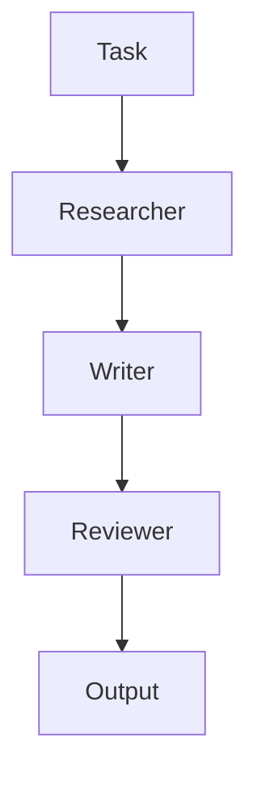

# Agent Orchestration Skill

## Overview

Coordinate multiple AI agents effectively. Design and implement multi-agent systems with proper communication, task delegation, error recovery, state management, and loop prevention.

## When to Use This Skill

- Task requires multiple agents
- User asks for agent coordination
- Complex multi-step workflows
- Need for parallel processing
- Multi-agent system design
- Agent communication patterns
- Error recovery in agent systems

## When NOT to Use This Skill

- Single-agent tasks with no coordination needed
- Simple deterministic workflows (no branching logic)
- Tasks with no inter-agent dependencies
- One-shot prompts that don't need orchestration
- Simple tool-calling chains (use tool-management instead)
- Tasks where a single agent can handle all subtasks

## Workflow

### Step 1: Plan Delegation

```
1. What tasks can be parallelized?
2. What tasks are sequential?
3. What are the dependencies?
4. What state needs to be shared?
5. What communication patterns are needed?
6. What error handling is required?
```

### Step 2: Design Agent Architecture

```
1. Choose coordination pattern:
   - Hub-and-spoke (central coordinator)
   - Peer-to-peer (distributed)
   - Hierarchical (tree structure)
   - Pipeline (sequential processing)
2. Define communication protocol
3. Design state management
4. Plan error recovery
```

### Step 3: Execute

```
1. Initialize agents with proper context
2. Start independent tasks in parallel
3. Wait for dependencies before starting dependent tasks
4. Collect and aggregate results
5. Handle failures gracefully
```

### Step 4: Verify & Monitor

```
1. All tasks completed?
2. Results are correct?
3. No agent loops?
4. State is consistent?
5. Performance acceptable?
```

## Advanced Techniques

### 1. Multi-Agent Coordination Patterns

#### Hub-and-Spoke Pattern
```python
from typing import Dict, List, Any
import asyncio

class HubAgent:
    """Central coordinator managing multiple worker agents"""
    def __init__(self):
        self.workers: Dict[str, WorkerAgent] = {}
        self.task_queue = asyncio.Queue()
        self.results: Dict[str, Any] = {}
    
    def register_worker(self, name: str, worker: 'WorkerAgent'):
        self.workers[name] = worker
        worker.hub = self
    
    async def delegate_task(self, task: dict, worker_name: str):
        if worker_name not in self.workers:
            raise ValueError(f"Worker {worker_name} not found")
        
        worker = self.workers[worker_name]
        result = await worker.execute(task)
        self.results[task['id']] = result
        return result
    
    async def parallel_execute(self, tasks: List[dict]):
        """Execute multiple tasks in parallel"""
        coroutines = []
        for task in tasks:
            worker_name = task.get('worker', list(self.workers.keys())[0])
            coroutines.append(self.delegate_task(task, worker_name))
        
        results = await asyncio.gather(*coroutines, return_exceptions=True)
        return results

class WorkerAgent:
    def __init__(self, name: str):
        self.name = name
        self.hub = None
    
    async def execute(self, task: dict) -> Any:
        # Worker-specific logic
        return {"status": "completed", "task_id": task['id']}
```

#### Peer-to-Peer Pattern
```python
import asyncio
from typing import Dict, Set
from dataclasses import dataclass
from enum import Enum

class MessageType(Enum):
    REQUEST = "request"
    RESPONSE = "response"
    BROADCAST = "broadcast"

@dataclass
class Message:
    type: MessageType
    sender: str
    receiver: str
    content: Any
    correlation_id: str = None

class PeerAgent:
    def __init__(self, name: str):
        self.name = name
        self.peers: Dict[str, 'PeerAgent'] = {}
        self.mailbox = asyncio.Queue()
        self.handlers = {}
    
    def connect(self, peer: 'PeerAgent'):
        self.peers[peer.name] = peer
        peer.peers[self.name] = self
    
    async def send(self, receiver_name: str, message: Message):
        if receiver_name not in self.peers:
            raise ValueError(f"Peer {receiver_name} not connected")
        await self.peers[receiver_name].mailbox.put(message)
    
    async def broadcast(self, message: Message):
        for peer_name, peer in self.peers.items():
            if peer_name != self.name:
                await peer.mailbox.put(message)
    
    async def run(self):
        while True:
            message = await self.mailbox.get()
            await self.handle_message(message)
    
    async def handle_message(self, message: Message):
        if message.type in self.handlers:
            await self.handlers[message.type](message)
```

#### Pipeline Pattern
```python
from typing import Callable, Any
import asyncio

class PipelineStage:
    def __init__(self, name: str, processor: Callable):
        self.name = name
        self.processor = processor
        self.input_queue = asyncio.Queue()
        self.output_queue = asyncio.Queue()
    
    async def process(self):
        while True:
            item = await self.input_queue.get()
            if item is None:  # Sentinel
                await self.output_queue.put(None)
                break
            result = await self.processor(item)
            await self.output_queue.put(result)

class Pipeline:
    def __init__(self, stages: list):
        self.stages = stages
        self._connect_stages()
    
    def _connect_stages(self):
        for i in range(len(self.stages) - 1):
            self.stages[i].output_queue = self.stages[i + 1].input_queue
    
    async def execute(self, data: Any):
        # Start all stages
        tasks = [stage.process() for stage in self.stages]
        
        # Feed data into first stage
        await self.stages[0].input_queue.put(data)
        await self.stages[0].input_queue.put(None)  # Sentinel
        
        # Wait for completion
        await asyncio.gather(*tasks)
        
        # Get result from last stage
        return await self.stages[-1].output_queue.get()

# Usage
async def stage1(item):
    return item * 2

async def stage2(item):
    return item + 10

async def stage3(item):
    return f"Result: {item}"

pipeline = Pipeline([
    PipelineStage("double", stage1),
    PipelineStage("add", stage2),
    PipelineStage("format", stage3)
])

result = await pipeline.execute(5)  # "Result: 20"
```

### 2. Communication Protocols

#### Message-Based Communication
```python
import json
import asyncio
from dataclasses import dataclass, asdict
from typing import Any, Optional
from enum import Enum
import uuid

class Protocol(Enum):
    REQUEST_RESPONSE = "req_res"
    PUB_SUB = "pub_sub"
    EVENT = "event"

@dataclass
class AgentMessage:
    id: str
    protocol: Protocol
    sender: str
    receiver: Optional[str]
    topic: Optional[str]
    payload: Any
    reply_to: Optional[str] = None
    timestamp: float = None

class MessageBroker:
    def __init__(self):
        self.subscribers: dict = {}
        self.message_queue = asyncio.Queue()
    
    async def publish(self, message: AgentMessage):
        await self.message_queue.put(message)
    
    def subscribe(self, topic: str, handler):
        if topic not in self.subscribers:
            self.subscribers[topic] = []
        self.subscribers[topic].append(handler)
    
    async def process_messages(self):
        while True:
            message = await self.message_queue.get()
            if message.topic in self.subscribers:
                for handler in self.subscribers[message.topic]:
                    await handler(message)

class AgentCommunication:
    def __init__(self, agent_id: str, broker: MessageBroker):
        self.agent_id = agent_id
        self.broker = broker
        self.pending_replies = {}
    
    async def request(self, receiver: str, payload: Any, timeout: float = 30) -> Any:
        """Send request and wait for response"""
        correlation_id = str(uuid.uuid4())
        
        message = AgentMessage(
            id=str(uuid.uuid4()),
            protocol=Protocol.REQUEST_RESPONSE,
            sender=self.agent_id,
            receiver=receiver,
            topic=None,
            payload=payload,
            reply_to=correlation_id
        )
        
        future = asyncio.Future()
        self.pending_replies[correlation_id] = future
        
        await self.broker.publish(message)
        
        try:
            return await asyncio.wait_for(future, timeout)
        except asyncio.TimeoutError:
            del self.pending_replies[correlation_id]
            raise TimeoutError(f"Request to {receiver} timed out")
    
    async def send_response(self, correlation_id: str, payload: Any):
        """Send response to a request"""
        message = AgentMessage(
            id=str(uuid.uuid4()),
            protocol=Protocol.REQUEST_RESPONSE,
            sender=self.agent_id,
            receiver=None,
            topic=None,
            payload=payload,
            reply_to=correlation_id
        )
        await self.broker.publish(message)
```

### 3. Task Delegation Patterns

#### Work Distribution
```python
from typing import List, Any, Callable
import asyncio
from dataclasses import dataclass
from enum import Enum

class TaskStatus(Enum):
    PENDING = "pending"
    IN_PROGRESS = "in_progress"
    COMPLETED = "completed"
    FAILED = "failed"

@dataclass
class Task:
    id: str
    payload: Any
    status: TaskStatus = TaskStatus.PENDING
    result: Any = None
    error: str = None
    assigned_to: str = None

class TaskDelegator:
    def __init__(self):
        self.agents = []
        self.task_queue = asyncio.Queue()
        self.results = {}
    
    def register_agent(self, agent):
        self.agents.append(agent)
    
    async def delegate(self, tasks: List[Task]):
        """Distribute tasks among agents"""
        for task in tasks:
            await self.task_queue.put(task)
        
        # Start workers
        workers = [self._worker() for _ in self.agents]
        await asyncio.gather(*workers)
        
        return self.results
    
    async def _worker(self):
        while True:
            try:
                task = self.task_queue.get_nowait()
            except asyncio.QueueEmpty:
                break
            
            # Find available agent
            agent = self._find_available_agent()
            if agent:
                task.assigned_to = agent.name
                task.status = TaskStatus.IN_PROGRESS
                
                try:
                    result = await agent.execute(task)
                    task.status = TaskStatus.COMPLETED
                    task.result = result
                    self.results[task.id] = task
                except Exception as e:
                    task.status = TaskStatus.FAILED
                    task.error = str(e)
                    self.results[task.id] = task
    
    def _find_available_agent(self):
        # Simple round-robin for now
        return self.agents[len(self.results) % len(self.agents)] if self.agents else None
```

#### Dynamic Task Allocation
```python
from typing import Dict, List
import asyncio

class DynamicAllocator:
    def __init__(self):
        self.agents: Dict[str, Agent] = {}
        self.load_balancer = LoadBalancer()
    
    async def allocate(self, tasks: List[Task]) -> Dict[str, List[Task]]:
        """Dynamically allocate tasks based on agent capabilities and load"""
        allocations = {agent_name: [] for agent_name in self.agents}
        
        for task in tasks:
            # Find best agent for this task
            best_agent = await self._find_best_agent(task)
            if best_agent:
                allocations[best_agent].append(task)
                self.load_balancer.record_assignment(best_agent, task)
        
        return allocations
    
    async def _find_best_agent(self, task: Task) -> str:
        """Find the best agent based on capability and current load"""
        candidates = []
        
        for name, agent in self.agents.items():
            if self._can_handle(agent, task):
                load_score = self.load_balancer.get_load(name)
                capability_score = self._get_capability_score(agent, task)
                candidates.append((name, load_score * capability_score))
        
        if candidates:
            # Return agent with lowest combined score
            return min(candidates, key=lambda x: x[1])[0]
        return None
    
    def _can_handle(self, agent: Agent, task: Task) -> bool:
        """Check if agent can handle this task"""
        return task.type in agent.capabilities
    
    def _get_capability_score(self, agent: Agent, task: Task) -> float:
        """Get capability score (0-1, higher is better)"""
        return agent.capabilities.get(task.type, 0)

class LoadBalancer:
    def __init__(self):
        self.loads: Dict[str, int] = {}
    
    def record_assignment(self, agent_name: str, task: Task):
        self.loads[agent_name] = self.loads.get(agent_name, 0) + task.weight
    
    def get_load(self, agent_name: str) -> float:
        return self.loads.get(agent_name, 0)
```

### 4. Error Recovery Patterns

#### Circuit Breaker Pattern
```python
import asyncio
from enum import Enum
from typing import Any, Callable
from dataclasses import dataclass
from datetime import datetime, timedelta

class CircuitState(Enum):
    CLOSED = "closed"      # Normal operation
    OPEN = "open"          # Failing, reject requests
    HALF_OPEN = "half_open"  # Testing if recovered

@dataclass
class CircuitBreaker:
    failure_threshold: int = 5
    recovery_timeout: timedelta = timedelta(seconds=30)
    
    def __post_init__(self):
        self.state = CircuitState.CLOSED
        self.failure_count = 0
        self.last_failure_time = None
    
    def record_success(self):
        self.failure_count = 0
        self.state = CircuitState.CLOSED
    
    def record_failure(self):
        self.failure_count += 1
        self.last_failure_time = datetime.now()
        
        if self.failure_count >= self.failure_threshold:
            self.state = CircuitState.OPEN
    
    def should_allow_request(self) -> bool:
        if self.state == CircuitState.CLOSED:
            return True
        elif self.state == CircuitState.OPEN:
            if datetime.now() - self.last_failure_time > self.recovery_timeout:
                self.state = CircuitState.HALF_OPEN
                return True
            return False
        else:  # HALF_OPEN
            return True

class ResilientAgent:
    def __init__(self):
        self.circuit_breakers: Dict[str, CircuitBreaker] = {}
    
    async def execute_with_retry(self, func: Callable, max_retries: int = 3) -> Any:
        """Execute function with retry and circuit breaker"""
        last_error = None
        
        for attempt in range(max_retries):
            try:
                result = await func()
                self._record_success()
                return result
            except Exception as e:
                last_error = e
                self._record_failure()
                
                if not self._should_retry(attempt, max_retries):
                    break
                
                # Exponential backoff
                await asyncio.sleep(2 ** attempt)
        
        raise last_error
    
    def _record_success(self):
        for cb in self.circuit_breakers.values():
            cb.record_success()
    
    def _record_failure(self):
        for cb in self.circuit_breakers.values():
            cb.record_failure()
    
    def _should_retry(self, attempt: int, max_retries: int) -> bool:
        return attempt < max_retries - 1
```

#### Fallback Strategy Pattern
```python
from typing import Any, Callable, List
import asyncio

class FallbackChain:
    def __init__(self):
        self.strategies: List[Callable] = []
    
    def add_strategy(self, strategy: Callable):
        self.strategies.append(strategy)
        return self
    
    async def execute(self, *args, **kwargs) -> Any:
        last_error = None
        
        for strategy in self.strategies:
            try:
                return await strategy(*args, **kwargs)
            except Exception as e:
                last_error = e
                continue
        
        raise Exception(f"All strategies failed. Last error: {last_error}")

# Usage
async def primary_strategy():
    return await call_primary_service()

async def fallback_strategy():
    return await call_backup_service()

async def default_strategy():
    return {"status": "default", "data": []}

chain = FallbackChain()
chain.add_strategy(primary_strategy)
chain.add_strategy(fallback_strategy)
chain.add_strategy(default_strategy)

result = await chain.execute()
```

### 5. State Management

#### Distributed State Manager
```python
import asyncio
from typing import Any, Dict, Optional
from dataclasses import dataclass
from enum import Enum
import json

class StateStatus(Enum):
    ACTIVE = "active"
    STALE = "stale"
    CONFLICT = "conflict"

@dataclass
class StateEntry:
    key: str
    value: Any
    version: int
    status: StateStatus
    last_updated: float

class StateManager:
    def __init__(self):
        self.state: Dict[str, StateEntry] = {}
        self.locks: Dict[str, asyncio.Lock] = {}
        self._global_lock = asyncio.Lock()
    
    async def get(self, key: str) -> Optional[Any]:
        async with self._global_lock:
            if key in self.state:
                return self.state[key].value
        return None
    
    async def set(self, key: str, value: Any, version: int = None) -> bool:
        async with self._global_lock:
            if key not in self.state:
                self.state[key] = StateEntry(
                    key=key,
                    value=value,
                    version=version or 1,
                    status=StateStatus.ACTIVE,
                    last_updated=asyncio.get_event_loop().time()
                )
                return True
            
            current = self.state[key]
            if version and current.version != version:
                return False  # Version conflict
            
            current.value = value
            current.version = (version or current.version) + 1
            current.last_updated = asyncio.get_event_loop().time()
            return True
    
    async def watch(self, key: str, callback: Callable):
        """Watch for state changes"""
        last_version = 0
        
        while True:
            async with self._global_lock:
                if key in self.state:
                    entry = self.state[key]
                    if entry.version > last_version:
                        await callback(entry)
                        last_version = entry.version
            await asyncio.sleep(0.1)  # Poll interval

class AgentState:
    def __init__(self, agent_id: str, state_manager: StateManager):
        self.agent_id = agent_id
        self.state_manager = state_manager
        self.local_state = {}
    
    async def update(self, key: str, value: Any):
        full_key = f"{self.agent_id}:{key}"
        await self.state_manager.set(full_key, value)
        self.local_state[key] = value
    
    async def get(self, key: str) -> Optional[Any]:
        full_key = f"{self.agent_id}:{key}"
        value = await self.state_manager.get(full_key)
        self.local_state[key] = value
        return value
    
    async def sync(self):
        """Sync local state with distributed state"""
        for key in list(self.local_state.keys()):
            full_key = f"{self.agent_id}:{key}"
            value = await self.state_manager.get(full_key)
            if value is not None:
                self.local_state[key] = value
```

### 6. Loop Prevention

#### Loop Detection & Prevention
```python
import asyncio
from typing import Set, Dict, Any
from dataclasses import dataclass
from enum import Enum
import hashlib

class LoopType(Enum):
    DIRECT = "direct"          # A → B → A
    TRANSITIVE = "transitive"  # A → B → C → A
    SELF = "self"              # A → A

@dataclass
class LoopDetector:
    max_history: int = 100
    max_retries: int = 3
    
    def __post_init__(self):
        self.history: Dict[str, int] = {}
        self.execution_path: list = []
    
    def can_execute(self, agent_id: str, task_id: str) -> bool:
        """Check if execution would create a loop"""
        key = self._make_key(agent_id, task_id)
        
        # Check for self-loop
        if agent_id == task_id:
            return False
        
        # Check for direct loop
        if key in self.history and self.history[key] >= self.max_retries:
            return False
        
        # Check for transitive loop
        if self._detect_loop(agent_id):
            return False
        
        return True
    
    def record_execution(self, agent_id: str, task_id: str):
        key = self._make_key(agent_id, task_id)
        self.history[key] = self.history.get(key, 0) + 1
        self.execution_path.append((agent_id, task_id))
        
        # Trim history if too long
        if len(self.execution_path) > self.max_history:
            self.execution_path = self.execution_path[-self.max_history:]
    
    def _make_key(self, agent_id: str, task_id: str) -> str:
        return f"{agent_id}:{task_id}"
    
    def _detect_loop(self, current_agent: str) -> bool:
        """Detect if adding current_agent would create a loop"""
        visited = set()
        stack = [current_agent]
        
        while stack:
            agent = stack.pop()
            if agent in visited:
                return True
            visited.add(agent)
            
            # Find agents this agent calls
            for entry_agent, entry_task in self.execution_path:
                if entry_agent == agent:
                    stack.append(entry_task)
        
        return False
    
    def get_loop_info(self) -> Dict[str, Any]:
        return {
            "history_size": len(self.history),
            "path_length": len(self.execution_path),
            "has_loops": self._detect_loop(None)
        }

class LoopPreventionMiddleware:
    def __init__(self):
        self.detector = LoopDetector()
    
    async def execute(self, agent: 'Agent', task: 'Task') -> Any:
        if not self.detector.can_execute(agent.id, task.id):
            raise RuntimeError(f"Loop detected: {agent.id} -> {task.id}")
        
        self.detector.record_execution(agent.id, task.id)
        
        try:
            return await agent.execute(task)
        finally:
            # Clean up on completion
            pass
```

### 7. Context Sharing

#### Shared Context Manager
```python
import asyncio
from typing import Any, Dict, Optional
from dataclasses import dataclass, field
import json

@dataclass
class SharedContext:
    """Context that can be shared between agents"""
    id: str
    data: Dict[str, Any] = field(default_factory=dict)
    metadata: Dict[str, Any] = field(default_factory=dict)
    version: int = 0
    lock: asyncio.Lock = field(default_factory=asyncio.Lock)
    
    async def get(self, key: str, default: Any = None) -> Any:
        async with self.lock:
            return self.data.get(key, default)
    
    async def set(self, key: str, value: Any):
        async with self.lock:
            self.data[key] = value
            self.version += 1
    
    async def update(self, updates: Dict[str, Any]):
        async with self.lock:
            self.data.update(updates)
            self.version += 1
    
    def snapshot(self) -> Dict[str, Any]:
        """Create a snapshot of current context"""
        return {
            "id": self.id,
            "data": self.data.copy(),
            "metadata": self.metadata.copy(),
            "version": self.version
        }

class ContextManager:
    def __init__(self):
        self.contexts: Dict[str, SharedContext] = {}
        self._lock = asyncio.Lock()
    
    async def create_context(self, context_id: str) -> SharedContext:
        async with self._lock:
            if context_id in self.contexts:
                return self.contexts[context_id]
            
            context = SharedContext(id=context_id)
            self.contexts[context_id] = context
            return context
    
    async def get_context(self, context_id: str) -> Optional[SharedContext]:
        async with self._lock:
            return self.contexts.get(context_id)
    
    async def share_between_agents(self, agent1: str, agent2: str, context_id: str):
        """Share context between two agents"""
        context = await self.get_context(context_id)
        if context:
            # In a real implementation, this would set up proper access
            pass

class AgentWithContext:
    def __init__(self, agent_id: str, context_manager: ContextManager):
        self.agent_id = agent_id
        self.context_manager = context_manager
        self.local_context: Optional[SharedContext] = None
    
    async def join_context(self, context_id: str):
        self.local_context = await self.context_manager.get_context(context_id)
    
    async def read_context(self, key: str) -> Any:
        if self.local_context:
            return await self.local_context.get(key)
        return None
    
    async def write_context(self, key: str, value: Any):
        if self.local_context:
            await self.local_context.set(key, value)
```

## Common Patterns

### Pattern 1: Fan-Out/Fan-In
```python
import asyncio
from typing import List, Any, Callable

async def fan_out_fan_in(
    tasks: List[Any],
    worker: Callable,
    aggregator: Callable,
    max_workers: int = 10
) -> Any:
    """Execute tasks in parallel and aggregate results"""
    # Create semaphore to limit concurrency
    semaphore = asyncio.Semaphore(max_workers)
    
    async def bounded_worker(task):
        async with semaphore:
            return await worker(task)
    
    # Fan out: execute all tasks
    results = await asyncio.gather(
        *[bounded_worker(task) for task in tasks],
        return_exceptions=True
    )
    
    # Filter out exceptions
    successful_results = [r for r in results if not isinstance(r, Exception)]
    
    # Fan in: aggregate results
    return await aggregator(successful_results)

# Usage
async def process_item(item):
    return item * 2

async def sum_results(results):
    return sum(results)

result = await fan_out_fan_in([1, 2, 3, 4, 5], process_item, sum_results)
```

### Pattern 2: Agent Registry
```python
from typing import Dict, Type
import asyncio

class AgentRegistry:
    def __init__(self):
        self._agents: Dict[str, Type] = {}
        self._instances: Dict[str, Any] = {}
    
    def register(self, name: str, agent_class: Type):
        self._agents[name] = agent_class
    
    async def get_or_create(self, name: str, **kwargs) -> Any:
        if name not in self._instances:
            if name not in self._agents:
                raise ValueError(f"Agent {name} not registered")
            self._instances[name] = self._agents[name](**kwargs)
        return self._instances[name]
    
    async def get_all(self) -> Dict[str, Any]:
        return self._instances.copy()

# Usage
registry = AgentRegistry()
registry.register("researcher", ResearchAgent)
registry.register("writer", WriterAgent)

researcher = await registry.get_or_create("researcher", topic="AI")
writer = await registry.get_or_create("writer", style="formal")
```

### Pattern 3: Task Queue with Priority
```python
import asyncio
from dataclasses import dataclass
from enum import IntEnum
from typing import Any
import heapq

class Priority(IntEnum):
    LOW = 0
    MEDIUM = 1
    HIGH = 2
    CRITICAL = 3

@dataclass(order=True)
class PrioritizedTask:
    priority: Priority
    task: Any = field(compare=False)
    
    def __init__(self, priority: Priority, task: Any):
        self.priority = priority
        self.task = task

class PriorityTaskQueue:
    def __init__(self):
        self._queue: list = []
        self._lock = asyncio.Lock()
    
    async def put(self, priority: Priority, task: Any):
        async with self._lock:
            heapq.heappush(self._queue, PrioritizedTask(priority, task))
    
    async def get(self) -> Any:
        async with self._lock:
            if self._queue:
                return heapq.heappop(self._queue).task
            return None
    
    @property
    def empty(self) -> bool:
        return len(self._queue) == 0
```

### Pattern 4: Agent Health Monitor
```python
import asyncio
from typing import Dict, List
from dataclasses import dataclass
from datetime import datetime

@dataclass
class HealthStatus:
    agent_id: str
    status: str  # "healthy", "degraded", "unhealthy"
    last_heartbeat: datetime
    error_count: int
    response_time_ms: float

class HealthMonitor:
    def __init__(self):
        self.agents: Dict[str, HealthStatus] = {}
        self.heartbeat_interval = 30  # seconds
    
    async def monitor(self):
        while True:
            for agent_id, status in self.agents.items():
                if self._is_unhealthy(status):
                    await self._handle_unhealthy(agent_id, status)
            await asyncio.sleep(self.heartbeat_interval)
    
    def _is_unhealthy(self, status: HealthStatus) -> bool:
        time_since_heartbeat = (datetime.now() - status.last_heartbeat).seconds
        return (
            time_since_heartbeat > self.heartbeat_interval * 2 or
            status.error_count > 10 or
            status.response_time_ms > 5000
        )
    
    async def _handle_unhealthy(self, agent_id: str, status: HealthStatus):
        print(f"Agent {agent_id} is unhealthy: {status}")
        # Restart agent, alert, etc.
```

### Pattern 5: Workflow Orchestrator
```python
import asyncio
from typing import List, Dict, Any
from dataclasses import dataclass
from enum import Enum

class StepStatus(Enum):
    PENDING = "pending"
    RUNNING = "running"
    COMPLETED = "completed"
    FAILED = "failed"
    SKIPPED = "skipped"

@dataclass
class WorkflowStep:
    id: str
    name: str
    agent: str
    depends_on: List[str] = None
    status: StepStatus = StepStatus.PENDING
    result: Any = None

class WorkflowOrchestrator:
    def __init__(self):
        self.steps: Dict[str, WorkflowStep] = {}
        self.results: Dict[str, Any] = {}
    
    def add_step(self, step: WorkflowStep):
        self.steps[step.id] = step
    
    async def execute(self):
        # Topological sort
        execution_order = self._get_execution_order()
        
        for step_group in execution_order:
            # Execute steps in parallel
            tasks = [self._execute_step(step_id) for step_id in step_group]
            await asyncio.gather(*tasks)
        
        return self.results
    
    async def _execute_step(self, step_id: str):
        step = self.steps[step_id]
        
        # Check dependencies
        if step.depends_on:
            for dep in step.depends_on:
                if self.steps[dep].status != StepStatus.COMPLETED:
                    step.status = StepStatus.SKIPPED
                    return
        
        step.status = StepStatus.RUNNING
        
        try:
            # Get agent and execute
            agent = await self._get_agent(step.agent)
            step.result = await agent.execute(step)
            step.status = StepStatus.COMPLETED
            self.results[step_id] = step.result
        except Exception as e:
            step.status = StepStatus.FAILED
            step.result = str(e)
    
    def _get_execution_order(self) -> List[List[str]]:
        """Return steps grouped by dependency level"""
        # Simple implementation - would use topological sort in production
        levels = []
        visited = set()
        
        while len(visited) < len(self.steps):
            level = []
            for step_id, step in self.steps.items():
                if step_id in visited:
                    continue
                if not step.depends_on or all(dep in visited for dep in step.depends_on):
                    level.append(step_id)
            
            if not level:
                break  # Circular dependency
            
            levels.append(level)
            visited.update(level)
        
        return levels
```

## Edge Cases & Pitfalls

1. **Agent Loop**: Agent A delegates to B, B delegates to C, C delegates to A
2. **Deadlock**: Two agents waiting for each other's response
3. **Race Condition**: Multiple agents modifying shared state simultaneously
4. **Context Drift**: Agents operating on stale context data
5. **Error Cascade**: One agent failure causing chain reaction
6. **Resource Exhaustion**: Too many agents consuming resources
7. **Communication Failure**: Messages lost or delayed
8. **State Inconsistency**: Agents have different views of state
9. **Task Starvation**: Some tasks never get executed
10. **Priority Inversion**: Low-priority tasks blocking high-priority ones
11. **Agent Identity Crisis**: Confusion about which agent is responsible
12. **Message Ordering**: Messages arrive out of order
13. **Timeout Handling**: Long-running tasks blocking others
14. **Graceful Shutdown**: Agents not cleaning up properly
15. **Version Conflicts**: Multiple agents updating same resource

## Integration with Other Skills

| Skill | Integration Type | Description |
|-------|-----------------|-------------|
| task-planning | Input | Plan orchestration strategy |
| debugging | Output | Debug agent coordination issues |
| performance-analysis | Collaboration | Optimize agent performance |
| concurrency-debugging | Collaboration | Fix concurrent agent issues |
| code-generation | Output | Generate agent code |
| testing | Output | Test multi-agent systems |
| deployment | Output | Deploy agent orchestration |
| documentation | Output | Document agent architecture |
| security | Input | Secure agent communication |

## Output Format Templates

### Template 1: Agent Orchestration Design
```markdown
# Agent Orchestration Design

## System Overview
- **Architecture Pattern**: [Hub-and-spoke/P2P/Hierarchical/Pipeline]
- **Number of Agents**: X
- **Communication Protocol**: [Message-based/Shared state/RPC]

## Agent Registry
| Agent ID | Type | Capabilities | Status |
|----------|------|--------------|--------|
| researcher | ResearchAgent | web_search, paper_analysis | Active |
| writer | WriterAgent | content_generation, editing | Active |
| reviewer | ReviewerAgent | quality_check, fact_check | Active |

## Workflow


## Communication Patterns
- [ ] Request-Response for synchronous calls
- [ ] Pub-Sub for event broadcasting
- [ ] Message queues for async processing

## Error Handling
- Circuit breaker for external calls
- Retry with exponential backoff
- Fallback strategies defined

## State Management
- Shared context for cross-agent data
- Local state for agent-specific data
- Version control for state changes
```

### Template 2: Agent Task Assignment
```markdown
# Task Assignment

## Task Details
- **Task ID**: TASK-001
- **Description**: Research latest AI developments
- **Priority**: HIGH
- **Dependencies**: None

## Assignment
- **Assigned Agent**: researcher
- **Expected Duration**: 30 minutes
- **Resources Required**: web_access, paper_database

## Execution Plan
1. Search for recent papers (5 min)
2. Analyze top 10 papers (15 min)
3. Generate summary (10 min)

## Success Criteria
- [ ] At least 10 papers analyzed
- [ ] Summary covers key trends
- [ ] Sources properly cited

## Monitoring
- Heartbeat interval: 30 seconds
- Progress updates: Every 5 minutes
- Timeout: 1 hour
```

### Template 3: Error Report
```markdown
# Agent Error Report

## Error Summary
- **Agent**: researcher
- **Error Type**: CommunicationTimeout
- **Timestamp**: 2024-01-15 10:30:00 UTC
- **Impact**: Task TASK-001 delayed

## Error Details
```
TimeoutError: Request to web_service timed out after 30s
Stack trace:
  File "agent.py", line 42, in execute
    result = await self.client.search(query)
  File "client.py", line 15, in search
    return await asyncio.wait_for(self._request(), timeout=30)
```

## Context
- **Task**: Research AI developments
- **Request**: GET /api/papers?q=AI
- **Retry Count**: 3/3

## Resolution
- [ ] Check network connectivity
- [ ] Verify service health
- [ ] Consider fallback strategy
- [ ] Update timeout configuration
```

### Template 4: Performance Report
```markdown
# Agent Performance Report

## System Metrics
| Metric | Value | Status |
|--------|-------|--------|
| Total Tasks | 150 | ✅ |
| Completed Tasks | 145 | ✅ |
| Failed Tasks | 5 | ⚠️ |
| Avg Response Time | 2.3s | ✅ |
| Throughput | 50 tasks/min | ✅ |

## Agent Performance
| Agent | Tasks | Success Rate | Avg Time |
|-------|-------|--------------|----------|
| researcher | 50 | 98% | 3.2s |
| writer | 50 | 100% | 1.8s |
| reviewer | 45 | 95% | 2.1s |

## Resource Usage
- **CPU**: 45% average
- **Memory**: 2.1 GB peak
- **Network**: 15 MB/s average

## Recommendations
1. Increase timeout for researcher agent
2. Add caching for repeated queries
3. Scale writer agent horizontally
```

## Rules

1. **ALWAYS** implement loop prevention in multi-agent systems
2. **ALWAYS** set maximum retry limits for agent operations
3. **ALWAYS** verify agent outputs before passing to next agent
4. **ALWAYS** handle agent failures gracefully
5. **ALWAYS** implement proper timeout handling
6. **ALWAYS** monitor agent health and performance
7. **NEVER** allow unlimited agent spawning
8. **ALWAYS** use proper communication protocols
9. **ALWAYS** implement circuit breakers for external calls
10. **ALWAYS** log agent interactions for debugging
11. **ALWAYS** test multi-agent systems under load
12. **ALWAYS** implement graceful shutdown procedures
13. **ALWAYS** version control agent configurations
14. **NEVER** assume agents are always available
15. **ALWAYS** document agent responsibilities and interfaces

## Anti-Patterns

- ❌ Infinite agent loops
- ❌ Not verifying agent outputs
- ❌ Sending conflicting instructions
- ❌ Not handling agent failures
- ❌ Shared mutable state without synchronization
- ❌ No timeout handling
- ❌ No circuit breaker for external calls
- ❌ No monitoring or logging
- ❌ No loop prevention mechanism
- ❌ No error recovery strategy
- ❌ No health checks
- ❌ No graceful shutdown
- ❌ No version control for configurations
- ❌ No load balancing
- ❌ No resource limits

## Skill Interactions

- ← task-planning: Plan the orchestration strategy
- → verification: Verify agent results
- → debugging: Debug agent coordination issues
- → performance-analysis: Optimize agent performance
- → concurrency-debugging: Fix concurrent agent issues
- → code-generation: Generate agent code
- → testing: Test multi-agent systems
- → deployment: Deploy agent orchestration
- → documentation: Document agent architecture
- → security: Secure agent communication
