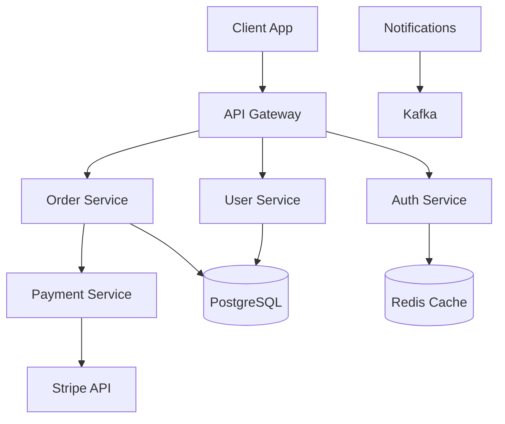
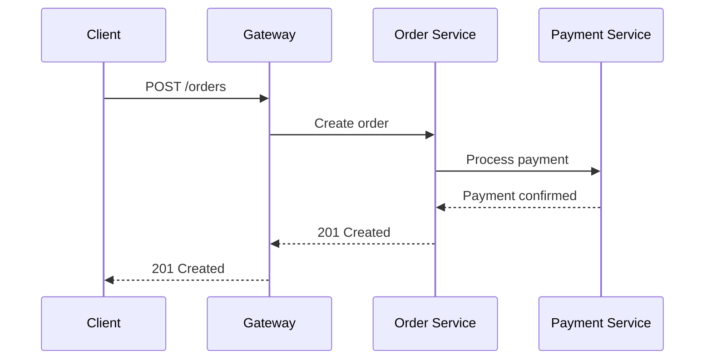
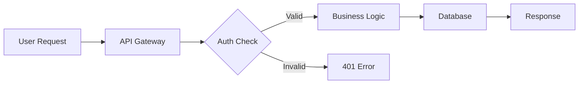
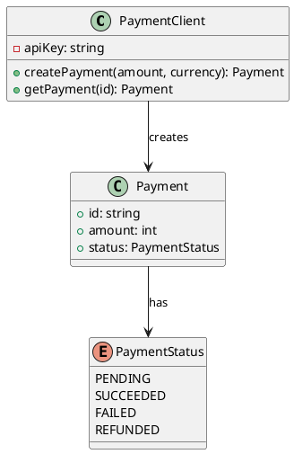

# Documentation Skill

## Overview

Create clear, useful, and maintainable documentation. Write for the reader, not the writer. Implement documentation-as-code practices with testing and continuous integration.

## When to Use This Skill

- User asks to write documentation
- New project needs README
- API needs documentation
- Code needs comments
- Architecture decisions need recording
- Runbooks for operations
- Deprecation notices needed
- SDK or CLI documentation
- Documentation testing required

## When NOT to Use This Skill

- Code changes that don't affect public interface
- Internal implementation details that change frequently
- One-off scripts with no reuse potential
- When the code itself is self-documenting (clear naming, types)
- Rapid prototyping where documentation would be outdated instantly
- When the user explicitly says "no docs needed"

## Workflow

### Step 1: Determine Documentation Type

```
What documentation?
├── README → Project overview, setup, usage
├── API Docs → Endpoints, schemas, examples
├── Architecture → Design decisions, trade-offs (ADRs)
├── Runbooks → Operational procedures
├── SDK Docs → Library usage, examples
├── CLI Docs → Command reference, tutorials
├── Tutorials → Step-by-step guides
├── Code Comments → Why, not what
└── Deprecation Notices → Migration paths
```

### Step 2: Plan Structure

```
1. Identify target audience
2. Define information architecture
3. Choose documentation format
4. Plan for maintainability
5. Set up doc-as-code pipeline
```

### Step 3: Write

```
Rules:
1. Start with WHY (purpose)
2. Then WHAT (features/capabilities)
3. Then HOW (setup/usage)
4. Keep it concise
5. Use examples
6. Keep it updated
7. Write for the reader
8. Use consistent terminology
```

### Step 4: Review & Test

```
1. Is it accurate?
2. Is it clear?
3. Is it complete?
4. Are examples working?
5. Is it accessible?
6. Does it follow style guide?
```

### Step 5: Maintain

```
1. Version control documentation
2. Automate testing
3. Set up review process
4. Plan for updates
5. Archive deprecated docs
```

## Advanced Techniques

### 1. README Templates

#### Project README Template
```markdown
# Project Name

[](https://github.com/username/repo)
[](https://github.com/username/repo)
[](LICENSE)

> One paragraph description of the project.

## Features

- ✨ Feature 1
- 🚀 Feature 2
- 🔒 Feature 3

## Quick Start

### Prerequisites

- Node.js >= 18
- PostgreSQL >= 14

### Installation

```bash
# Clone the repository
git clone https://github.com/username/repo.git
cd repo

# Install dependencies
npm install

# Set up environment
cp .env.example .env

# Start development server
npm run dev
```

### Docker

```bash
docker-compose up -d
```

## Usage

```javascript
const { myFunction } = require('my-package');

const result = myFunction({
  option1: 'value1',
  option2: 'value2'
});

console.log(result);
```

## API Reference

| Method | Description | Parameters |
|--------|-------------|------------|
| `myFunction(options)` | Does something | `options: { option1: string, option2: string }` |

## Configuration

| Variable | Description | Default |
|----------|-------------|---------|
| `PORT` | Server port | `3000` |
| `DATABASE_URL` | PostgreSQL connection | `localhost:5432` |

## Contributing

1. Fork the repository
2. Create your feature branch (`git checkout -b feature/amazing`)
3. Commit your changes (`git commit -m 'Add amazing feature'`)
4. Push to the branch (`git push origin feature/amazing`)
5. Open a Pull Request

## License

This project is licensed under the MIT License - see the [LICENSE](LICENSE) file for details.

## Support

- 📧 Email: support@example.com
- 💬 Discord: [Join our server](https://discord.gg/example)
- 📖 Documentation: [docs.example.com](https://docs.example.com)
```

#### Library README Template
```markdown
# package-name

> Brief description of what this package does.

[](https://www.npmjs.com/package/package-name)
[](https://bundlephobia.com/package/package-name)

## Installation

```bash
npm install package-name
# or
yarn add package-name
# or
pnpm add package-name
```

## Quick Start

```typescript
import { something } from 'package-name';

const result = something('input');
```

## API

### `something(input: string): Result`

Description of the function.

**Parameters:**
- `input` - Description

**Returns:**
- `Result` - Description

**Example:**
```typescript
const result = something('hello');
// Result { value: 'world' }
```

## TypeScript

This package includes TypeScript types.

## License

MIT
```

### 2. API Documentation (OpenAPI/Swagger)

#### OpenAPI Specification
```yaml
openapi: 3.0.3
info:
  title: API Title
  description: |
    ## Overview
    This API provides...
    
    ## Authentication
    All endpoints require Bearer token.
  version: 1.0.0
  contact:
    name: API Support
    email: support@example.com
  license:
    name: MIT

servers:
  - url: https://api.example.com/v1
    description: Production
  - url: https://staging-api.example.com/v1
    description: Staging

paths:
  /users:
    get:
      summary: List users
      operationId: listUsers
      tags:
        - Users
      parameters:
        - name: limit
          in: query
          required: false
          schema:
            type: integer
            minimum: 1
            maximum: 100
            default: 20
        - name: offset
          in: query
          required: false
          schema:
            type: integer
            minimum: 0
            default: 0
      responses:
        '200':
          description: Successful response
          content:
            application/json:
              schema:
                type: object
                properties:
                  data:
                    type: array
                    items:
                      $ref: '#/components/schemas/User'
                  total:
                    type: integer
                  hasMore:
                    type: boolean
        '401':
          $ref: '#/components/responses/Unauthorized'
        '500':
          $ref: '#/components/responses/InternalError'

components:
  schemas:
    User:
      type: object
      required:
        - id
        - email
      properties:
        id:
          type: string
          format: uuid
        email:
          type: string
          format: email
        name:
          type: string
        createdAt:
          type: string
          format: date-time

  securitySchemes:
    bearerAuth:
      type: http
      scheme: bearer
      bearerFormat: JWT

  responses:
    Unauthorized:
      description: Authentication required
      content:
        application/json:
          schema:
            $ref: '#/components/schemas/Error'
    InternalError:
      description: Internal server error
      content:
        application/json:
          schema:
            $ref: '#/components/schemas/Error'

security:
  - bearerAuth: []
```

#### API Documentation Generator
```javascript
// api-docs-generator.js
const swaggerJsdoc = require('swagger-jsdoc');
const swaggerUi = require('swagger-ui-express');

const options = {
  definition: {
    openapi: '3.0.0',
    info: {
      title: 'API Title',
      version: '1.0.0',
    },
  },
  apis: ['./routes/*.js'], // Path to API docs
};

const specs = swaggerJsdoc(options);

app.use('/api-docs', swaggerUi.serve, swaggerUi.setup(specs));
```

### 3. Architecture Decision Records (ADRs)

#### ADR Template
```markdown
# ADR-{NUMBER}: {TITLE}

## Status

{Proposed | Accepted | Deprecated | Superseded by [ADR-{NUMBER}]}

## Date

{YYYY-MM-DD}

## Context

{What is the issue that we're seeing that is motivating this decision or change?}

## Decision

{What is the change that we're proposing and/or doing?}

## Consequences

### Positive
- {List positive outcomes}

### Negative
- {List negative outcomes}

### Neutral
- {List neutral outcomes}

## Alternatives Considered

### {Alternative 1}
- **Pros**: {List pros}
- **Cons**: {List cons}
- **Reason rejected**: {Why not chosen}

### {Alternative 2}
- **Pros**: {List pros}
- **Cons**: {List cons}
- **Reason rejected**: {Why not chosen}

## References

- [Link to relevant docs]
- [Link to related ADRs]
```

#### ADR Example
```markdown
# ADR-001: Use PostgreSQL as Primary Database

## Status

Accepted

## Date

2024-01-15

## Context

We need a reliable, scalable relational database for our application. The system requires:
- ACID compliance for financial transactions
- Full-text search capabilities
- JSON support for flexible data
- Strong community and ecosystem

## Decision

We will use PostgreSQL as our primary database.

## Consequences

### Positive
- Excellent ACID compliance
- Rich feature set (JSONB, full-text search, CTEs)
- Strong community and ecosystem
- Great tooling (pgAdmin, psql, ORMs)

### Negative
- Requires more operational knowledge than SQLite
- Vertical scaling limitations (though horizontal is possible with Citus)
- Connection pooling complexity

### Neutral
- Team needs to learn PostgreSQL-specific features
- Migration from current SQLite will require data migration

## Alternatives Considered

### MySQL
- **Pros**: Wide adoption, good performance
- **Cons**: Less feature-rich, licensing concerns
- **Reason rejected**: Missing advanced features we need

### MongoDB
- **Pros**: Flexible schema, horizontal scaling
- **Cons**: No ACID compliance, different query model
- **Reason rejected**: Need relational data model for financial data

### SQLite
- **Pros**: Simple, no server required
- **Cons**: No concurrent writes, limited scalability
- **Reason rejected**: Can't handle production workload

## References

- https://www.postgresql.org/docs/
- [ADR-002: Database Schema Design](./ADR-002.md)
```

### 4. Runbooks

#### Runbook Template
```markdown
# Runbook: {SERVICE_NAME}

## Overview

**Service**: {service_name}
**Owner**: {team_name}
**Last Updated**: {date}
**Severity**: {P0/P1/P2/P3}

## Monitoring

- **Dashboard**: [Link to Grafana/Datadog]
- **Alerts**: [Link to alerting rules]
- **Logs**: [Link to log aggregation]

## Common Issues

### Issue 1: {SYMPTOM}

**Symptoms**:
- Error message: `{error_message}`
- Dashboard shows: {metric anomaly}
- User reports: {user-facing symptom}

**Diagnosis**:
```bash
# Check service health
curl -f http://localhost:8080/health

# Check logs
tail -f /var/log/service/error.log

# Check metrics
curl -s http://localhost:9090/metrics | grep service_errors
```

**Resolution**:
1. {Step 1}
2. {Step 2}
3. {Step 3}

**Escalation**:
If unresolved after 30 minutes, escalate to {team/channel}

### Issue 2: {SYMPTOM}

**Symptoms**:
- {Description}

**Diagnosis**:
```bash
{Commands}
```

**Resolution**:
1. {Steps}

## Emergency Procedures

### Service Down
1. Check service status: `{command}`
2. Restart service: `{command}`
3. If restart fails, check dependencies:
   - Database: `{command}`
   - Cache: `{command}`
   - Queue: `{command}`
4. Scale up if needed: `{command}`
5. Page on-call if not restored in 15 minutes

### Data Corruption
1. Stop writes immediately: `{command}`
2. Take snapshot: `{command}`
3. Assess damage: `{command}`
4. Restore from backup if needed: `{command}`
5. Notify stakeholders

## Maintenance Procedures

### Database Migration
1. Run migration in staging first: `{command}`
2. Verify staging: `{command}`
3. Schedule maintenance window
4. Run migration in production: `{command}`
5. Verify production: `{command}`
6. Monitor for 24 hours

### Dependency Update
1. Check changelog for breaking changes
2. Update in development branch
3. Run full test suite
4. Deploy to staging
5. QA testing
6. Deploy to production with rollback plan

## Contacts

| Role | Name | Contact |
|------|------|---------|
| Primary On-Call | {name} | {slack/email} |
| Secondary On-Call | {name} | {slack/email} |
| Database Admin | {name} | {slack/email} |
| Security | {name} | {slack/email} |

## References

- [Architecture Diagram](./architecture.md)
- [API Documentation](./api-docs.md)
- [Incident Response Plan](./incident-response.md)
```

### 5. Deprecation Notices

#### Deprecation Notice Template
```markdown
# Deprecation Notice: {FEATURE_NAME}

**Deprecation Date**: {date}
**Sunset Date**: {date}
**Status**: Deprecated

## Summary

The `{feature_name}` is being deprecated in favor of `{replacement}`.

## Timeline

| Date | Event |
|------|-------|
| {date} | Feature deprecated |
| {date} | Warning messages added |
| {date} | Feature disabled (can be re-enabled) |
| {date} | Feature removed |

## Migration Guide

### Before
```javascript
// Old way (deprecated)
const result = oldFeature(options);
```

### After
```javascript
// New way
const result = newFeature(options);
```

### Step-by-Step Migration

1. **Update imports**
   ```diff
   - import { oldFeature } from 'package';
   + import { newFeature } from 'package';
   ```

2. **Update function calls**
   ```diff
   - const result = oldFeature(opts);
   + const result = newFeature(opts);
   ```

3. **Test your changes**
   ```bash
   npm test
   ```

## Why Deprecated

- {Reason 1: Better performance}
- {Reason 2: More features}
- {Reason 3: Security improvements}

## Support

- Migration questions: {slack/email}
- Bug reports: {github issues}
- Documentation: {link}

## Frequently Asked Questions

### Q: Do I have to migrate now?
A: No, but the feature will be removed on {sunset_date}.

### Q: What if I can't migrate?
A: Contact {team} for assistance.

### Q: Is the replacement backwards compatible?
A: {Answer}
```

### 6. SDK Documentation

#### SDK Docs Structure
```markdown
# SDK Documentation

## Getting Started

### Installation
```bash
npm install @company/sdk
```

### Quick Start
```typescript
import { Client } from '@company/sdk';

const client = new Client({
  apiKey: process.env.API_KEY
});

// Make your first API call
const result = await client.users.list();
```

## Authentication

### API Key
```typescript
const client = new Client({
  apiKey: 'your-api-key'
});
```

### OAuth
```typescript
const client = new Client({
  clientId: 'your-client-id',
  clientSecret: 'your-client-secret',
  redirectUri: 'https://your-app.com/callback'
});

// Get authorization URL
const authUrl = client.getAuthorizationUrl({
  scope: ['read', 'write']
});

// Exchange code for tokens
const tokens = await client.exchangeCode(code);
```

## API Reference

### Users

#### `client.users.list(options?)`
List all users.

**Parameters:**
- `options.limit` (number): Max users to return (default: 20)
- `options.offset` (number): Pagination offset

**Returns:** `Promise<User[]>`

**Example:**
```typescript
const users = await client.users.list({ limit: 10 });
console.log(users);
// [{ id: '1', name: 'John', ... }, ...]
```

#### `client.users.get(userId)`
Get a specific user.

**Parameters:**
- `userId` (string): User ID

**Returns:** `Promise<User>`

**Example:**
```typescript
const user = await client.users.get('user-123');
console.log(user.name);
// 'John Doe'
```

#### `client.users.create(data)`
Create a new user.

**Parameters:**
- `data.name` (string): User's name
- `data.email` (string): User's email

**Returns:** `Promise<User>`

**Example:**
```typescript
const newUser = await client.users.create({
  name: 'Jane Doe',
  email: 'jane@example.com'
});
```

## Error Handling

```typescript
import { Client, ApiError } from '@company/sdk';

try {
  const user = await client.users.get('invalid-id');
} catch (error) {
  if (error instanceof ApiError) {
    console.error(`API Error: ${error.status} - ${error.message}`);
  } else {
    console.error('Unexpected error:', error);
  }
}
```

## Rate Limiting

The SDK automatically handles rate limiting:
- Retries failed requests (up to 3 times)
- Respects `Retry-After` headers
- Implements exponential backoff

## Webhooks

```typescript
import { WebhookHandler } from '@company/sdk';

const handler = new WebhookHandler({
  secret: process.env.WEBHOOK_SECRET
});

app.post('/webhooks', (req, res) => {
  const event = handler.verify(req.body, req.headers);
  
  switch (event.type) {
    case 'user.created':
      handleUserCreated(event.data);
      break;
    // ... handle other events
  }
  
  res.status(200).send('OK');
});
```

## TypeScript Support

Full TypeScript definitions included. No additional `@types` package needed.

## Examples

- [Basic Usage](./examples/basic.ts)
- [Authentication](./examples/auth.ts)
- [Webhooks](./examples/webhooks.ts)
- [Error Handling](./examples/errors.ts)
```

### 7. CLI Documentation

#### CLI Docs Template
```markdown
# CLI Reference

## Overview

`mycli` is a command-line tool for managing [application].

## Installation

```bash
# npm
npm install -g mycli

# Homebrew
brew install mycli

# Direct download
curl -fsSL https://get.mycli.com | sh
```

## Global Options

```
Usage: mycli [options] [command]

Options:
  -V, --version         output the version number
  --verbose             enable verbose output
  --quiet               suppress output
  --no-color            disable colored output
  -h, --help            display help for command
```

## Commands

### `mycli init`

Initialize a new project.

```bash
mycli init [options]

Options:
  --template <name>   project template (default: "default")
  --dir <path>        target directory (default: ".")
  -h, --help          display help for command

Examples:
  $ mycli init
  $ mycli init --template api --dir ./my-project
```

### `mycli serve`

Start development server.

```bash
mycli serve [options]

Options:
  -p, --port <port>    port number (default: 3000)
  -h, --host <host>    host to bind (default: "localhost")
  --https              enable HTTPS
  --open               open browser automatically
  -h, --help           display help for command

Examples:
  $ mycli serve
  $ mycli serve --port 8080
  $ mycli serve --https --open
```

### `mycli build`

Build for production.

```bash
mycli build [options]

Options:
  -o, --outDir <dir>   output directory (default: "dist")
  --minify             minify output (default: true)
  --sourcemap          generate source maps (default: false)
  -h, --help           display help for command

Examples:
  $ mycli build
  $ mycli build --outDir ./build --sourcemap
```

### `mycli test`

Run tests.

```bash
mycli test [options]

Options:
  --watch              watch mode
  --coverage           generate coverage report
  --reporter <name>    test reporter (default: "dot")
  -h, --help           display help for command

Examples:
  $ mycli test
  $ mycli test --watch --coverage
```

## Configuration

### `.myclirc`

```json
{
  "port": 3000,
  "template": "default",
  "plugins": ["plugin-a", "plugin-b"]
}
```

### Environment Variables

| Variable | Description | Default |
|----------|-------------|---------|
| `MYCLI_PORT` | Server port | `3000` |
| `MYCLI_HOST` | Server host | `localhost` |
| `MYCLI_VERBOSE` | Enable verbose | `false` |

## Exit Codes

| Code | Description |
|------|-------------|
| 0 | Success |
| 1 | General error |
| 2 | Invalid arguments |
| 3 | File not found |
| 4 | Permission denied |

## Examples

### CI/CD Pipeline

```yaml
# .github/workflows/ci.yml
steps:
  - name: Install CLI
    run: npm install -g mycli
  
  - name: Build
    run: myci build --minify
  
  - name: Test
    run: mycli test --coverage
```

### Docker

```dockerfile
FROM node:18-alpine
RUN npm install -g mycli
WORKDIR /app
COPY . .
RUN mycli build
CMD ["mycli", "serve"]
```
```

### 8. Doc-as-Code Pipeline

#### Documentation Pipeline Configuration
```yaml
# .github/workflows/docs.yml
name: Documentation

on:
  push:
    branches: [main]
    paths:
      - 'docs/**'
      - 'README.md'
  pull_request:
    branches: [main]

jobs:
  lint:
    runs-on: ubuntu-latest
    steps:
      - uses: actions/checkout@v3
      
      - name: Lint Markdown
        uses: avto-dev/markdown-lint@v1
        with:
          args: './docs/**/*.md'
      
      - name: Check links
        uses: lycheeverse/lychee-action@v1
        with:
          args: '--verbose "./docs/**/*.md" "./README.md"'

  build:
    runs-on: ubuntu-latest
    steps:
      - uses: actions/checkout@v3
      
      - name: Setup Node
        uses: actions/setup-node@v3
        with:
          node-version: '18'
      
      - name: Install dependencies
        run: npm ci
      
      - name: Build docs
        run: npm run docs:build
      
      - name: Upload artifact
        uses: actions/upload-pages-artifact@v1
        with:
          path: ./docs-dist

  deploy:
    runs-on: ubuntu-latest
    needs: build
    if: github.ref == 'refs/heads/main'
    steps:
      - name: Deploy to GitHub Pages
        uses: peaceiris/actions-gh-pages@v3
        with:
          github_token: ${{ secrets.GITHUB_TOKEN }}
          publish_dir: ./docs-dist
```

#### Documentation Build Script
```javascript
// docs/build.js
const fs = require('fs');
const path = require('path');
const marked = require('marked');

const docsDir = './docs';
const outputDir = './docs-dist';

// Ensure output directory exists
if (!fs.existsSync(outputDir)) {
  fs.mkdirSync(outputDir, { recursive: true });
}

// Process all markdown files
const files = fs.readdirSync(docsDir).filter(f => f.endsWith('.md'));

files.forEach(file => {
  const content = fs.readFileSync(path.join(docsDir, file), 'utf8');
  const html = marked(content);
  
  const outputFile = file.replace('.md', '.html');
  fs.writeFileSync(path.join(outputDir, outputFile), html);
});

console.log(`Built ${files.length} documentation files`);
```

### 9. Documentation Testing

#### Documentation Test Suite
```javascript
// docs/__tests__/documentation.test.js
const fs = require('fs');
const path = require('path');
const { marked } = require('marked');

describe('Documentation', () => {
  const docsDir = path.join(__dirname, '../docs');
  
  test('all markdown files are valid', () => {
    const files = fs.readdirSync(docsDir).filter(f => f.endsWith('.md'));
    
    files.forEach(file => {
      const content = fs.readFileSync(path.join(docsDir, file), 'utf8');
      expect(() => marked(content)).not.toThrow();
    });
  });
  
  test('README has required sections', () => {
    const readme = fs.readFileSync(
      path.join(__dirname, '../../README.md'),
      'utf8'
    );
    
    expect(readme).toContain('## Installation');
    expect(readme).toContain('## Usage');
    expect(readme).toContain('## License');
  });
  
  test('code examples are valid', () => {
    const readme = fs.readFileSync(
      path.join(__dirname, '../../README.md'),
      'utf8'
    );
    
    // Extract code blocks
    const codeBlocks = readme.match(/```[\s\S]*?```/g) || [];
    
    codeBlocks.forEach(block => {
      // Check for syntax errors (simplified)
      const code = block.replace(/```\w*\n?/, '').replace(/```$/, '');
      expect(code.length).toBeGreaterThan(0);
    });
  });
  
  test('links are not broken', async () => {
    const readme = fs.readFileSync(
      path.join(__dirname, '../../README.md'),
      'utf8'
    );
    
    // Extract internal links
    const internalLinks = readme.match(/\[.*?\]\(\.\.\/.*?\)/g) || [];
    
    internalLinks.forEach(link => {
      const match = link.match(/\((.*?)\)/);
      if (match) {
        const filePath = path.join(__dirname, '../../README.md', '..', match[1]);
        // Check if file exists (simplified)
        expect(fs.existsSync(filePath)).toBe(true);
      }
    });
  });
  
  test('API docs match implementation', () => {
    const apiDocs = fs.readFileSync(
      path.join(docsDir, 'api.md'),
      'utf8'
    );
    
    // Check documented functions exist in source
    const documentedFunctions = apiDocs.match(/### `(\w+)`/g) || [];
    
    documentedFunctions.forEach(func => {
      const funcName = func.match(/`(\w+)`/)[1];
      // Check in source files (simplified)
      expect(true).toBe(true); // Placeholder
    });
  });
});
```

#### Documentation Linting Rules
```markdown
<!-- .markdownlint.yml -->
# Documentation Linting Rules

MD001:
  level: 1  # Heading levels increment by one
MD003:
  style: atx  # ATX-style headings
MD013:
  line_length: 120  # Max line length
MD024:
  siblings_only: true  # No duplicate headings in same parent
MD033:
  allowed_elements:
    - img
    - br
    - details
    - summary
MD041:
  first_line_heading: true  # First line must be heading
MD045:
  alt_style: descriptive  # Images must have alt text
```

### 10. Incremental Documentation Strategy

Don't try to document everything at once. Build documentation incrementally, starting with the highest-value content and expanding as the project matures. This prevents documentation paralysis and ensures effort matches value.

```markdown
# Documentation Roadmap — Incremental Strategy

## Phase 1: Foundation (Week 1-2)
Priority: HIGH — Blocking new contributors and users

- [ ] README with Quick Start (badges, install, first usage)
- [ ] CONTRIBUTING.md with development setup
- [ ] LICENSE file
- [ ] Basic API reference (endpoints, parameters, responses)
- [ ] Code of Conduct (for open-source)

## Phase 2: Core Content (Week 3-4)
Priority: HIGH — Reducing support burden

- [ ] Getting Started tutorial (setup → first success → expand → next steps)
- [ ] Configuration reference (all options with defaults and examples)
- [ ] Top 5 troubleshooting guides (from support ticket analysis)
- [ ] Deployment guide (staging + production)
- [ ] Changelog (Keep a Changelog format)

## Phase 3: Depth (Week 5-8)
Priority: MEDIUM — Enabling advanced use cases

- [ ] Architecture Decision Records for key decisions
- [ ] Runbooks for critical operations (top 3 incidents)
- [ ] SDK documentation with working examples
- [ ] Performance tuning guide
- [ ] Migration guides for breaking changes
- [ ] FAQ from common support questions

## Phase 4: Polish (Week 9-12)
Priority: LOW — Improving discoverability and completeness

- [ ] Diagrams as documentation (architecture, data flow, sequence)
- [ ] i18n framework for international docs
- [ ] Interactive examples and playgrounds
- [ ] Video walkthroughs for complex tutorials
- [ ] Documentation CI pipeline (lint, test, deploy)

## Phase 5: Maintenance (Ongoing)
Priority: ONGOING — Preventing documentation decay

- [ ] Quarterly documentation review
- [ ] Deprecation notice process (30-day sunset policy)
- [ ] Documentation freshness monitoring (stale pages alert)
- [ ] User feedback integration (support tickets → doc improvements)
- [ ] Analytics tracking (which pages are visited, where users drop off)
```

**Key principles:**
1. **Start with what blocks people** — If new users can't install the project, write the README first. If operators can't fix outages, write runbooks first.
2. **Write only what's needed** — Don't document internal implementation details nobody looks up. Focus on the surface area people interact with.
3. **Iterate, don't perfect** — A 200-line README published today is better than a 2000-line guide published never.
4. **Let usage guide investment** — Track which documentation pages get the most traffic and invest in those first.
5. **Build the pipeline early** — Set up linting, testing, and CI in Phase 1. Every doc you write after that gets quality checks automatically.

### 11. i18n Documentation Workflow

Internationalize documentation without duplicating source management. Use a layered approach: source language in the main branch, translations in language-specific directories, with automated sync when source content changes.

```
docs/
├── en/                    # Source language (English)
│   ├── getting-started.md
│   ├── api-reference.md
│   └── runbooks/
├── fa/                    # فارسی (Farsi)
│   ├── getting-started.md
│   └── api-reference.md
├── zh/                    # 中文 (Chinese)
│   ├── getting-started.md
│   └── api-reference.md
├── i18n/
│   ├── config.yml         # Translation configuration
│   ├── glossary.yml       # Technical term translations
│   └── style-guide.yml    # Translation style rules
└── .github/
    └── workflows/
        └── sync-translations.yml
```

```yaml
# docs/i18n/config.yml
source_language: en
target_languages:
  - code: fa
    name: فارسی
    direction: rtl
    status: partial       # 40% translated
  - code: zh
    name: 中文
    direction: ltr
    status: partial       # 60% translated
  - code: ja
    name: 日本語
    direction: ltr
    status: not_started

translation_sync:
  method: parallel        # Sync source changes to translation branches
  auto_create_pr: true    # Create PR when source docs change
  alert_after_days: 30    # Alert if translation is >30 days stale
  required_for_release: false  # Don't block releases on translations
```

```yaml
# docs/i18n/glossary.yml
terms:
  - en: "API Key"
    fa: "کلید API"
    zh: "API 密钥"
  - en: "Endpoint"
    fa: "نقطه پایانی"
    zh: "端点"
  - en: "Deprecation"
    fa: "منسوخ شدن"
    zh: "弃用"
  - en: "Runbook"
    fa: "کتابچه راهنما"
    zh: "运行手册"
```

**i18n best practices:**
1. **Write source docs with translation in mind** — Avoid idioms, cultural references, and sentence structures that don't translate well.
2. **Use a glossary** — Define technical term translations once and enforce consistency across all languages.
3. **Don't block releases on translations** — Translations should lag behind source content, not gate releases.
4. **Monitor staleness** — Alert when translations are more than 30 days behind the source.
5. **Design for RTL** — Farsi and Arabic require right-to-left layout. Test your documentation site with RTL languages before adding them.

### 12. Diagrams as Documentation (Mermaid, PlantUML)

Diagrams communicate complex relationships faster than text. Version-control diagrams alongside code using text-based formats (Mermaid, PlantUML) that render in GitHub, GitLab, and documentation sites.

```markdown
## Architecture Diagram (Mermaid)



## Sequence Diagram (Mermaid)



## Data Flow (Mermaid)



## Class Diagram (PlantUML)


```

**Diagram best practices:**
1. **Use text-based formats** — Mermaid and PlantUML are version-controllable, diffable, and renderable. Avoid embedded images for architecture diagrams.
2. **Keep diagrams focused** — One diagram per concept. A single diagram with 50 nodes communicates nothing.
3. **Label everything** — Every node, edge, and relationship should have a descriptive label.
4. **Use consistent notation** — Pick a style (rectangles for services, cylinders for databases, diamonds for decisions) and stick with it.
5. **Include diagrams in the same PR as code changes** — Architecture diagrams should be updated in the same PR that changes the architecture.

## Common Patterns

### Pattern 1: Living Documentation
```markdown
# Living Documentation

## Auto-Generated Sections

<!-- AUTO-GENERATED:START - Run 'npm run docs:api' to update -->
### API Reference

| Endpoint | Method | Description |
|----------|--------|-------------|
| `/users` | GET | List users |
| `/users/:id` | GET | Get user |
| `/users` | POST | Create user |
<!-- AUTO-GENERATED:END -->

## Manual Sections

### Design Decisions

{Manual documentation that doesn't change often}
```

### Pattern 2: Documentation Versioning
```yaml
# mkdocs.yml
site_name: My Project
theme:
  name: material

nav:
  - Home: index.md
  - Getting Started: getting-started.md
  - API Reference: api.md

plugins:
  - search
  - versioning:
      default: latest
      aliases:
        latest: 2.0
        dev: 3.0-beta

extra:
  version:
    provider: mike
    default: latest
```

### Pattern 3: Interactive Examples
```markdown
# Interactive Example

<details>
<summary>Click to expand code example</summary>

```typescript
// This code is tested in CI
import { myFunction } from 'my-package';

const result = myFunction({
  option: 'value'
});

console.log(result);
// Expected: { status: 'success' }
```

</details>

### Try it yourself

```bash
# Clone and run
git clone https://github.com/example/repo.git
cd repo
npm install
npm run example:interactive
```
```

### Pattern 4: Changelog Management
```markdown
# Changelog

All notable changes to this project will be documented in this file.

The format is based on [Keep a Changelog](https://keepachangelog.com/en/1.0.0/),
and this project adheres to [Semantic Versioning](https://semver.org/spec/v2.0.0.html).

## [Unreleased]

### Added
- New feature X
- Support for Y

### Changed
- Updated Z to version 2.0

### Deprecated
- Feature A (use Feature B instead)

### Removed
- Feature C (was deprecated in v1.2.0)

### Fixed
- Bug in module D

### Security
- Fixed vulnerability in component E

## [1.2.0] - 2024-01-15

### Added
- Feature F

### Fixed
- Bug G
```

### Pattern 5: Documentation Site Structure
```
docs/
├── index.md                    # Homepage
├── getting-started/
│   ├── installation.md
│   ├── quickstart.md
│   └── configuration.md
├── guides/
│   ├── basic-usage.md
│   ├── advanced-usage.md
│   └── best-practices.md
├── api/
│   ├── reference.md
│   ├── examples.md
│   └── sdks.md
├── architecture/
│   ├── overview.md
│   ├── decisions/
│   │   ├── ADR-001.md
│   │   └── ADR-002.md
│   └── diagrams/
├── operations/
│   ├── deployment.md
│   ├── monitoring.md
│   └── runbooks/
├── contributing/
│   ├── guidelines.md
│   └── code-of-conduct.md
├── changelog.md
├── faq.md
└── glossary.md
```

## Edge Cases & Pitfalls

1. **Outdated documentation**: Docs don't match code
2. **Missing documentation**: Undocumented features
3. **Inconsistent terminology**: Same thing called different names
4. **Broken links**: Links to non-existent pages
5. **Code examples don't work**: Outdated or incorrect examples
6. **No versioning**: Old docs not archived
7. **Poor search**: Users can't find what they need
8. **Missing context**: Docs assume too much knowledge
9. **No examples**: Theory without practical application
10. **Overwhelming content**: Too much information at once
11. **No translation**: English-only documentation
12. **Missing diagrams**: Complex concepts without visuals
13. **No index**: No table of contents or navigation
14. **Inconsistent formatting**: Different styles throughout
15. **No feedback mechanism**: Users can't report issues

## Integration with Other Skills

| Skill | Integration Type | Description |
|-------|-----------------|-------------|
| project-analysis | Input | Understand what to document |
| code-review | Collaboration | Review documentation changes |
| testing | Output | Documentation testing |
| deployment | Input | Deploy documentation |
| security | Input | Security documentation |
| ai-agent-orchestration | Output | Document agent systems |
| performance-analysis | Output | Document optimizations |
| debugging | Output | Document troubleshooting |

## Output Format Templates

### Template 1: Documentation Plan
```markdown
# Documentation Plan

## Project: {project_name}

## Audience
- **Primary**: {developers/operators/end-users}
- **Secondary**: {other_audience}
- **Skill Level**: {beginner/intermediate/advanced}

## Documentation Types
- [ ] README (essential)
- [ ] API Documentation
- [ ] Architecture Decision Records
- [ ] Runbooks
- [ ] Tutorials
- [ ] SDK Documentation
- [ ] CLI Documentation

## Content Structure
```
docs/
├── index.md
├── getting-started/
├── guides/
├── api/
├── architecture/
└── operations/
```

## Timeline
| Phase | Deliverable | Due Date |
|-------|-------------|----------|
| 1 | README + Quickstart | {date} |
| 2 | API Documentation | {date} |
| 3 | Architecture Docs | {date} |
| 4 | Runbooks | {date} |

## Maintenance
- **Review cycle**: {monthly/quarterly}
- **Owner**: {team/person}
- **Process**: {description}
```

### Template 2: API Documentation Checklist
```markdown
# API Documentation Checklist

## For Each Endpoint
- [ ] Clear description
- [ ] Request method and path
- [ ] All parameters documented
- [ ] Request body schema
- [ ] Response schema
- [ ] Error responses
- [ ] Authentication requirements
- [ ] Rate limiting info
- [ ] Example request/response
- [ ] Code snippets (cURL, JS, Python)

## For Schemas
- [ ] All fields documented
- [ ] Types specified
- [ ] Required vs optional
- [ ] Default values
- [ ] Enum values listed
- [ ] Example values

## For Authentication
- [ ] Auth method explained
- [ ] How to obtain credentials
- [ ] Token format
- [ ] Expiration handling
- [ ] Scopes/permissions

## For Errors
- [ ] Error format defined
- [ ] All error codes listed
- [ ] Error messages helpful
- [ ] Recovery suggestions
```

### Template 3: Documentation Review
```markdown
# Documentation Review

## Reviewer: {name}
## Date: {date}
## Document: {title}

## Accuracy
- [ ] Code examples work
- [ ] Links are valid
- [ ] Information is current
- [ ] Technical details correct

## Clarity
- [ ] Easy to understand
- [ ] Good flow/structure
- [ ] Appropriate length
- [ ] Jargon explained

## Completeness
- [ ] All sections present
- [ ] No missing information
- [ ] Examples included
- [ ] Prerequisites listed

## Style
- [ ] Consistent formatting
- [ ] Correct grammar/spelling
- [ ] Inclusive language
- [ ] Follows style guide

## Suggestions
1. {Suggestion 1}
2. {Suggestion 2}
3. {Suggestion 3}

## Approval
- [ ] Approved
- [ ] Approved with minor changes
- [ ] Needs revision
```

### Template 4: Deprecation Checklist
```markdown
# Deprecation Checklist

## Feature: {name}

## Pre-Deprecation
- [ ] Replacement identified and documented
- [ ] Migration guide written
- [ ] Timeline communicated
- [ ] Stakeholders notified

## Implementation
- [ ] Deprecation warnings added
- [ ] Documentation updated
- [ ] Examples updated
- [ ] SDK/CLI updated

## Communication
- [ ] Blog post/announcement
- [ ] Email to users
- [ ] Social media
- [ ] Changelog updated

## Post-Deprecation
- [ ] Usage monitored
- [ ] Support tickets tracked
- [ ] Final removal scheduled
- [ ] Archive old docs

## Rollback Plan
- [ ] Can re-enable if needed
- [ ] Data preservation plan
- [ ] Communication plan
```

## Rules

1. **ALWAYS** write for the reader, not the writer
2. **ALWAYS** start with WHY, then WHAT, then HOW
3. **ALWAYS** include working code examples
4. **ALWAYS** keep documentation up to date
5. **ALWAYS** use consistent terminology
6. **ALWAYS** version control documentation
7. **ALWAYS** test documentation examples
8. **NEVER** assume reader knowledge
9. **ALWAYS** provide context and prerequisites
10. **ALWAYS** use clear, concise language
11. **ALWAYS** include a table of contents for long docs
12. **ALWAYS** link related documentation
13. **ALWAYS** document breaking changes
14. **ALWAYS** provide migration guides for deprecations
15. **ALWAYS** include contact information for support

## Anti-Patterns

- ❌ Documentation that lies (outdated information)
- ❌ Documentation without examples
- ❌ Writing what the code does (instead of why)
- ❌ Overly verbose documentation
- ❌ No documentation at all
- ❌ Broken links and references
- ❌ Missing API documentation
- ❌ No versioning or changelog
- ❌ Documentation that assumes too much knowledge
- ❌ Inconsistent terminology and formatting
- ❌ No search functionality
- ❌ Missing diagrams for complex concepts
- ❌ No feedback mechanism
- ❌ Documentation as afterthought
- ❌ No maintenance plan

## Skill Interactions

- ← project-analysis: Understand what to document
- → verification: Verify documentation accuracy
- → code-review: Review documentation changes
- → testing: Test documentation examples
- → deployment: Deploy documentation
- → security: Document security practices
- → ai-agent-orchestration: Document agent systems
- → performance-analysis: Document optimizations
- → debugging: Document troubleshooting
