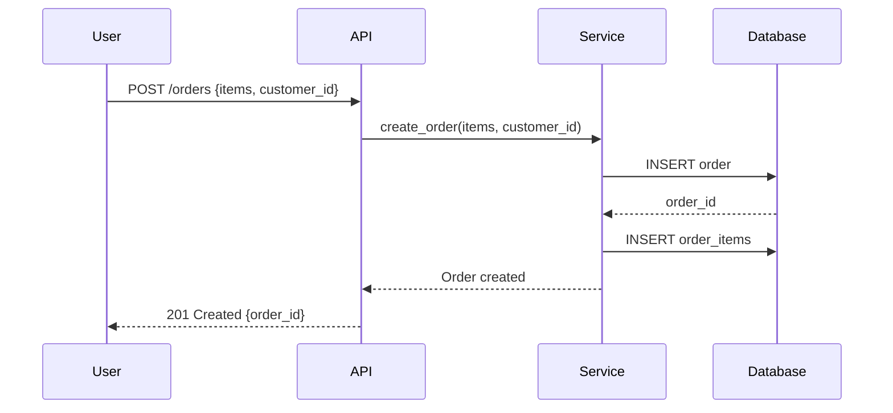
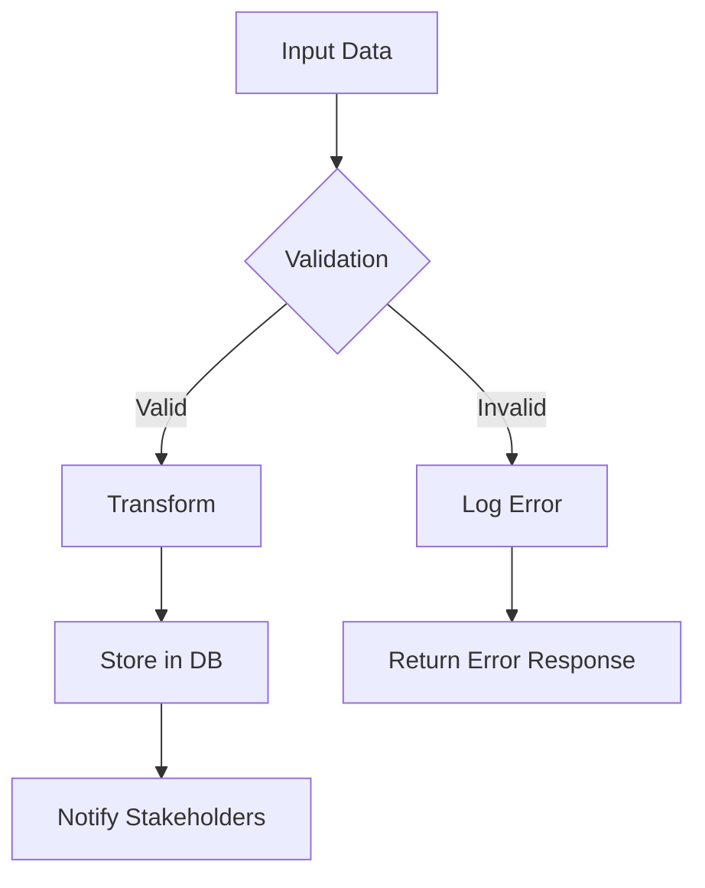
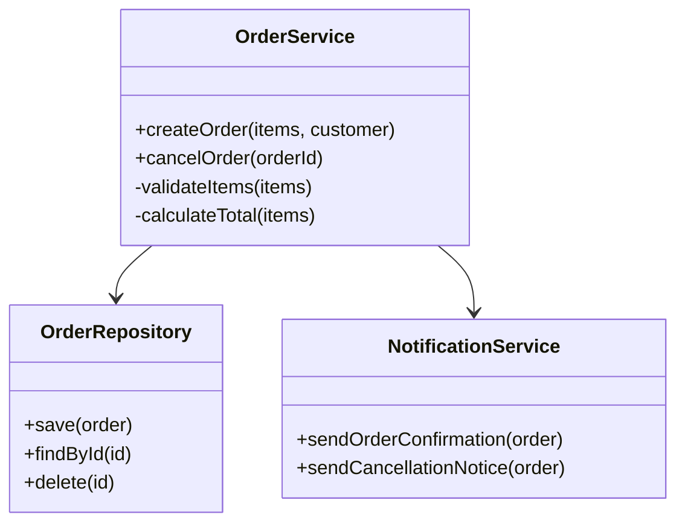
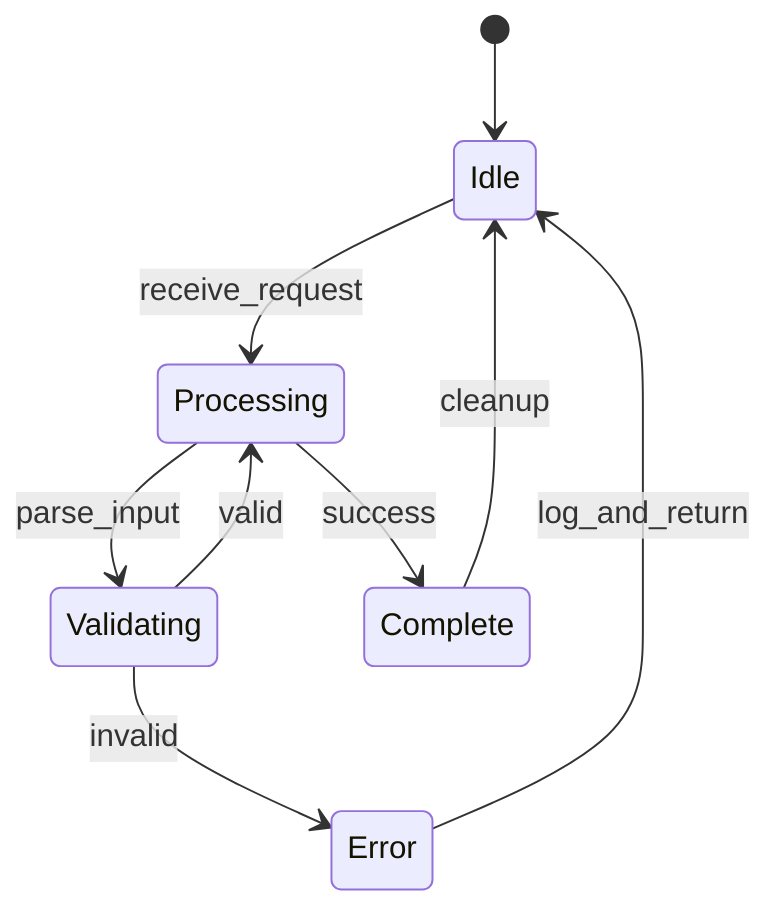

# Explain Code Skill — Multi-Level Code Understanding

## Overview

This skill breaks down code into understandable pieces. It explains not just *what* code does, but *how* it works and *why* it's structured that way. Explanations are layered — a quick summary first, then progressive detail for those who need depth.

This skill supports visual diagrams (Mermaid), data flow explanations, architecture walkthroughs, algorithm explanations, and interactive Q&A-style exploration.

## When to Use This Skill

- User asks what a piece of code does
- User wants to understand an unfamiliar codebase or module
- User needs a walkthrough of an algorithm or complex function
- User is learning and wants line-by-line or concept-level explanation
- User asks "how does this work?" or "why is it written this way?"
- User wants to understand the architecture of a system
- User asks for a visual diagram of code flow

---

## Explanation Techniques

### Technique 1: Layered Explanation (Default)

Structure every explanation in three layers so the user can stop reading at the level that satisfies them:

#### Layer 1: One-Sentence Summary
A single sentence explaining what the code does, in plain language.

**Example:**
> "This function takes a list of transactions, groups them by customer, and calculates the total spending for each customer, returning a sorted list of top spenders."

#### Layer 2: High-Level Walkthrough
A paragraph or bullet list describing the main flow, key components, and their roles. No code snippets at this level — just concepts.

**Example:**
> "The system works as a pipeline:
> 1. **Ingestion**: Raw data comes in from three sources (CSV files, API endpoints, database streams)
> 2. **Validation**: Each record is checked for required fields and data types
> 3. **Transformation**: Valid records are normalized into a common schema
> 4. **Storage**: Transformed records are written to a data warehouse
> 5. **Notification**: Stakeholders are notified of new data availability"

#### Layer 3: Detailed Breakdown
For each significant function or section:
- What it does and why
- How it works step by step
- Important edge cases or subtle behavior
- Any non-obvious design decisions

Use inline code references (file:function or line numbers) to anchor the explanation.

### Technique 2: Visual Diagrams (Mermaid)

When code involves complex relationships, generate Mermaid diagrams:









### Technique 3: Data Flow Explanation

When code transforms data, trace the data through each step:

```
Input: {"users": [{"name": "Alice", "age": 30}, {"name": "Bob", "age": 17}]}

Step 1 - parse_json():
  Input:  raw JSON string
  Output: {"users": [{"name": "Alice", "age": 30}, {"name": "Bob", "age": 17}]}

Step 2 - filter_adults():
  Input:  {"users": [{"name": "Alice", "age": 30}, {"name": "Bob", "age": 17}]}
  Rule:   keep where age >= 18
  Output: {"users": [{"name": "Alice", "age": 30}]}

Step 3 - format_output():
  Input:  {"users": [{"name": "Alice", "age": 30}]}
  Output: [{"name": "Alice", "age": 30, "status": "adult"}]
```

### Technique 4: Algorithm Explanation Template

For explaining algorithms, use this template:

```
## Algorithm: [Name]

### Purpose
[What problem does this algorithm solve?]

### Input/Output
- Input: [type and description]
- Output: [type and description]

### Key Idea
[One-paragraph plain-language explanation of the core insight]

### Step-by-Step
1. [First step]
2. [Second step]
...

### Complexity
- Time: O(...) — [why]
- Space: O(...) — [why]

### Example Walkthrough
[Trace through a small concrete example]

### When to Use / When Not to Use
[Practical guidance]
```

**Example — Binary Search:**
```
## Algorithm: Binary Search

### Purpose
Find a target value in a sorted array efficiently.

### Input/Output
- Input: A sorted array and a target value
- Output: The index of the target, or -1 if not found

### Key Idea
Instead of checking every element (O(n)), divide the search space in half
at each step by comparing the target to the middle element.

### Step-by-Step
1. Set low = 0, high = len(array) - 1
2. While low <= high:
   a. Calculate mid = (low + high) / 2
   b. If array[mid] == target: return mid
   c. If array[mid] < target: search right half (low = mid + 1)
   d. If array[mid] > target: search left half (high = mid - 1)
3. Return -1 (not found)

### Complexity
- Time: O(log n) — each step halves the search space
- Space: O(1) — only a few variables needed

### Example Walkthrough
Array: [2, 5, 8, 12, 16, 23, 38, 56, 72, 91]
Target: 23

Step 1: low=0, high=9, mid=4 → array[4]=16 < 23 → search right
Step 2: low=5, high=9, mid=7 → array[7]=56 > 23 → search left
Step 3: low=5, high=6, mid=5 → array[5]=23 = 23 → FOUND at index 5
```

### Technique 5: Architecture Explanation

For system-level code, explain the architecture:

```
## Architecture: [System Name]

### Overview
[One paragraph: what the system does, for whom, and why it exists]

### Components
[Diagram showing major components and their relationships]

### Data Flow
[How data moves through the system from input to output]

### Key Design Decisions
1. [Decision]: [Rationale]
2. [Decision]: [Rationale]

### Trade-offs
- [What was gained by this architecture]
- [What was sacrificed or limited]

### Extension Points
- [Where new features would be added]
- [What would need to change for scaling]
```

### Technique 6: Interactive Q&A Walkthrough

For complex code, structure as a guided exploration:

```
## Code Walkthrough: [Function/Module Name]

### Starting Point
[What this code does in one sentence]

### Question 1: What are the inputs?
[Answer with details about each parameter]

### Question 2: What's the first thing it does?
[Explain the first logical block]

### Question 3: What happens in the main loop/condition?
[Explain the core logic]

### Question 4: How are errors handled?
[Explain error handling paths]

### Question 5: What are the edge cases?
[Explain boundary conditions and how they're handled]

### Summary
[One paragraph recap]
```

---

## Explanation Workflow

### Step 1: Read the Code

1. Read the file(s) the user wants explained using the Read tool.
2. If the code references other files (imports, dependencies), read those too to understand the full picture.
3. Identify the language, framework, and domain.

### Step 2: Build a Mental Model

Before explaining, construct your understanding:

- **Purpose**: What problem does this code solve?
- **Inputs/Outputs**: What goes in, what comes out?
- **Data flow**: How does data transform from input to output?
- **Key abstractions**: What are the main components and how do they relate?
- **Patterns used**: Are there recognizable design patterns?
- **Dependencies**: What external systems or libraries does it rely on?
- **Side effects**: Does the code modify external state (files, databases, APIs)?
- **Error handling**: How are failures detected and reported?

### Step 3: Choose the Right Technique

| Code Type | Best Technique |
|-----------|---------------|
| Simple function | Layered Explanation (3 layers) |
| Algorithm | Algorithm Explanation Template |
| Data pipeline | Data Flow Explanation |
| System/module | Architecture Explanation |
| Complex codebase | Interactive Q&A Walkthrough |
| Code with many relationships | Visual Diagrams (Mermaid) |

### Step 4: Deliver Layered Explanation

Start with Layer 1 (one sentence), then provide Layer 2 and Layer 3 as the user needs more detail. Use diagrams when they add clarity.

### Step 5: Address Follow-Up Questions

If the user asks follow-up questions, dive deeper into the specific area. Common follow-ups:
- "Why was X implemented this way instead of Y?"
- "What happens if Z is null/empty/wrong?"
- "Can you explain this specific function in more detail?"
- "How would this code change if [requirement] changed?"

---

## More Layered Explanation Examples

### Example 1: React Component

**Layer 1:**
> "This is a React component that renders a paginated, searchable table of users with loading and error states."

**Layer 2:**
> "The component manages three pieces of state: the current page number, the search query, and the fetched user data. It uses a custom hook to fetch data whenever the page or search query changes, with debouncing on the search input. Error and loading states are shown to the user via conditional rendering."

**Layer 3:**
> "`UserTable` uses `useState` for `page`, `query`, and `data`. The `useEffect` hook triggers on `page`/`query` changes, calling `fetchUsers(page, query)` with a 300ms debounce via `useDebounce`. The debounced value is stored in `debouncedQuery`. The component renders a `<SearchInput>` that updates `query`, pagination buttons that increment/decrement `page`, and either a loading spinner, error message, or the data table depending on state. The `formatDate` helper converts ISO strings to locale-specific format."

### Example 2: Python Decorator

**Layer 1:**
> "This is a retry decorator that automatically retries a function when it raises specific exceptions."

**Layer 2:**
> "It wraps a function and catches specified exception types. When a retryable exception occurs, it waits for an exponentially increasing delay (1s, 2s, 4s...) and tries again, up to a maximum number of attempts. Non-retryable exceptions pass through immediately."

**Layer 3:**
> "The `@retry` decorator accepts `max_attempts`, `retry_on`, and `backoff_factor` parameters. It uses `functools.wraps` to preserve the original function's metadata. Inside the retry loop, `time.sleep(delay)` implements exponential backoff: `delay = backoff_factor ** attempt`. Each attempt catches exceptions from the `retry_on` tuple. After exhausting attempts, it raises the last exception. Non-retryable exceptions are raised immediately without retry."

---

## Key Design Decisions Explanation Patterns

When explaining *why* code is structured a certain way, use these patterns:

### Pattern: "Why this data structure?"
> "A HashMap is used here because we need O(1) lookup by key. The alternative (searching a list) would be O(n) per lookup, making the overall algorithm O(n²) instead of O(n)."

### Pattern: "Why this design pattern?"
> "The Strategy pattern is used here because the calculation logic varies based on customer type. Instead of a long if/else chain, each strategy is a separate class. This makes adding new customer types trivial (just add a new class) without modifying the existing code."

### Pattern: "Why this error handling?"
> "Errors are propagated with `Result<T, E>` instead of panicking because this is a library function. Panicking would crash the caller's application. Returning `Err` lets the caller decide how to handle the failure."

### Pattern: "Why this API design?"
> "The builder pattern is used because the function has 7 optional parameters. A regular function with 7 params would be unreadable. The builder makes each parameter explicit and allows sensible defaults."

---

## Output Format

```
## Code Explanation

**File:** [file path]
**Language/Framework:** [detected stack]

### Summary
[One-sentence explanation]

### How It Works
[High-level walkthrough with bullet points]

### Detailed Breakdown
#### [Section/Function 1]
[Explanation]

#### [Section/Function 2]
[Explanation]

### Data Flow
[Trace data through the code]

### Visual Diagram
[Mermaid diagram if applicable]

### Key Design Decisions
- [Decision 1]: [Why it was made]
- [Decision 2]: [Why it was made]

### Potential Questions
- [Anticipate and answer likely follow-up questions]
```

## Rules

- Always read the actual code before explaining. Never explain from assumptions.
- Start simple. Not everyone asking for an explanation is a beginner, but everyone benefits from a clear starting point.
- Use the user's language for all explanation text. Keep code references and technical terms in English.
- If the code is poorly written or contains bugs, note them as an aside but don't turn the explanation into a code review.
- If a section of code is standard boilerplate (e.g., import statements, basic config), summarize it briefly rather than explaining each line.
- Admit when you're unsure. If a line's purpose is genuinely ambiguous given the available context, say so.
- Use diagrams when they add clarity, not just for decoration.
- Tailor the explanation depth to the user's apparent expertise level.
