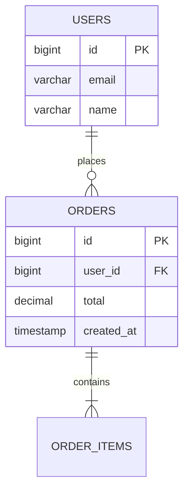

# Database Schema Skill — Data Modeling & SQL Schema Design

## Overview

This skill produces concrete, production-ready database schemas. It covers entity identification, relationship modeling, normalization, indexing strategy, and generates actual SQL (or ORM-specific) schemas that can be run directly. The focus is on correctness, performance, and maintainability.

## When to Use This Skill

- User needs to design a database for a new project or feature
- User asks to create tables, model relationships, or design a schema
- User needs an ER diagram or visual representation of their data model
- User wants help with normalization, indexing, or query optimization
- User needs to convert a conceptual design into SQL or ORM code
- User needs to add tables to an existing database
- User wants to model a specific domain (e-commerce, social media, SaaS, etc.)
- User needs migration scripts for schema changes
- User asks about indexing strategies for specific query patterns
- User needs to design for multi-tenancy, soft deletes, or audit trails

## Schema Design Workflow

### Phase 1: Identify Entities

1. **Extract nouns from the problem description** — Each noun is a candidate entity (User, Order, Product, etc.)
2. **Distinguish entities from attributes** — "User email" is an attribute of User, not a separate entity
3. **Check for value objects** — Some nouns are better as fields (address, money amount) than tables
4. **Validate against requirements** — Does this entity map to a real concept in the domain?
5. **Consider temporal entities** — Are there time-based versions? (price history, order status history)

### Phase 2: Define Attributes & Types

For each entity, define columns with:

- **Primary key** — Always include one. Use `BIGSERIAL`/`BIGINT AUTO_INCREMENT`/UUID depending on scale and distributed needs
- **Required fields** — Mark NOT NULL constraints
- **Data types** — Be specific: `VARCHAR(255)`, `DECIMAL(10,2)`, `TIMESTAMPTZ`, not just `string`
- **Default values** — Set sensible defaults (e.g., `NOW()` for created_at)
- **Constraints** — CHECK constraints for business rules, UNIQUE where needed
- **Column ordering** — PK first, then FKs, then data columns, then metadata columns

### Phase 3: Define Relationships

Map each relationship and choose the right pattern:

| Relationship | Pattern | Implementation |
|--------------|---------|----------------|
| **One-to-many** | Parent has many children | Foreign key on the "many" table |
| **Many-to-many** | Posts have many tags | Junction/join table with two foreign keys |
| **One-to-one** | User has one profile | Foreign key with UNIQUE constraint, or same table |
| **Self-referencing** | Category has subcategories | Foreign key referencing same table |
| **Polymorphic** | Comments on posts or videos | Separate table per type (preferred) or nullable FKs (simpler but weaker) |

For each foreign key, specify:
- **ON DELETE** behavior (CASCADE, SET NULL, RESTRICT)
- **Indexing** — Foreign keys should almost always be indexed

### Phase 4: Normalize

Apply normalization up to 3NF:

1. **1NF** — No repeating groups, atomic values
2. **2NF** — No partial dependencies (all non-key fields depend on the full primary key)
3. **3NF** — No transitive dependencies (non-key fields depend only on the primary key)

Also consider when to **denormalize** for read performance (e.g., cached counts, materialized views).

### Phase 5: Indexing Strategy

1. **Primary keys** — Automatically indexed by the database
2. **Foreign keys** — Add indexes on all foreign key columns
3. **Unique constraints** — Automatically indexed
4. **Query-driven indexes** — Identify the most common query patterns and add composite indexes to support them
5. **Covering indexes** — For critical read queries, include all needed columns in the index to avoid table lookups
6. **Partial indexes** — Index only a subset of rows (e.g., `WHERE status = 'active'`)
7. **Expression indexes** — Index on computed values (e.g., `LOWER(email)`)

### Phase 6: Add Metadata & Audit

Every table should have:
- `created_at TIMESTAMPTZ NOT NULL DEFAULT NOW()`
- `updated_at TIMESTAMPTZ NOT NULL DEFAULT NOW()` (with trigger or app-level update)

Consider:
- `deleted_at` for soft deletes
- `created_by` for audit trails
- `version` for optimistic locking

## Advanced Techniques

### 1. Multi-Tenancy Patterns

```sql
-- Pattern A: Shared schema, tenant_id column (most common)
CREATE TABLE tenants (
    id BIGSERIAL PRIMARY KEY,
    name VARCHAR(255) NOT NULL,
    slug VARCHAR(50) UNIQUE NOT NULL
);

CREATE TABLE projects (
    id BIGSERIAL PRIMARY KEY,
    tenant_id BIGINT NOT NULL REFERENCES tenants(id),
    name VARCHAR(255) NOT NULL,
    -- always filter by tenant_id in queries
);
CREATE INDEX idx_projects_tenant ON projects(tenant_id);

-- Row-Level Security (PostgreSQL) for automatic tenant isolation
ALTER TABLE projects ENABLE ROW LEVEL SECURITY;
CREATE POLICY tenant_isolation ON projects
    USING (tenant_id = current_setting('app.tenant_id')::BIGINT);
```

### 2. Event Sourcing / Append-Only Patterns

```sql
-- Instead of updating a row, append events
CREATE TABLE account_events (
    id BIGSERIAL PRIMARY KEY,
    account_id BIGINT NOT NULL,
    sequence BIGINT NOT NULL,
    event_type VARCHAR(50) NOT NULL,
    payload JSONB NOT NULL,
    created_at TIMESTAMPTZ NOT NULL DEFAULT NOW(),
    UNIQUE (account_id, sequence)
);

-- Materialized view for current state
CREATE MATERIALIZED VIEW account_balances AS
SELECT
    account_id,
    (payload->>'amount')::DECIMAL AS balance
FROM (
    SELECT account_id, payload,
           ROW_NUMBER() OVER (PARTITION BY account_id ORDER BY sequence DESC) as rn
    FROM account_events
) latest
WHERE rn = 1;
```

### 3. Hierarchical Data (Nested Sets + Materialized Path)

```sql
-- Materialized path pattern (simpler than nested sets, good for reads)
CREATE TABLE categories (
    id BIGSERIAL PRIMARY KEY,
    name VARCHAR(255) NOT NULL,
    path VARCHAR(1000) NOT NULL DEFAULT '',  -- e.g., '1/5/12/'
    depth INT NOT NULL DEFAULT 0,
    -- Get all descendants: WHERE path LIKE '1/5/%'
    -- Get ancestors: SELECT * FROM categories WHERE id = ANY(string_to_array(path, '/')::int[])
);

CREATE INDEX idx_categories_path ON categories USING gin (path gin_trgm_ops);
CREATE INDEX idx_categories_depth ON categories(depth);
```

### 4. Optimistic Locking

```sql
CREATE TABLE products (
    id BIGSERIAL PRIMARY KEY,
    name VARCHAR(255) NOT NULL,
    price DECIMAL(10,2) NOT NULL,
    version INT NOT NULL DEFAULT 1,
    updated_at TIMESTAMPTZ NOT NULL DEFAULT NOW()
);

-- Application: UPDATE products SET name=$1, price=$2, version=version+1
--   WHERE id=$3 AND version=$4;
-- If rows_affected = 0, another process updated it first → conflict
```

### 5. JSONB for Semi-Structured Data

```sql
-- Use JSONB for flexible attributes that don't need strict schema
CREATE TABLE products (
    id BIGSERIAL PRIMARY KEY,
    name VARCHAR(255) NOT NULL,
    attributes JSONB NOT NULL DEFAULT '{}',
    -- attributes: {"color": "red", "weight": 2.5, "tags": ["sale", "new"]}
    search_vector TSVECTOR GENERATED ALWAYS AS (
        to_tsvector('english', name || ' ' || attributes::text)
    ) STORED
);

-- GIN index for JSONB queries
CREATE INDEX idx_products_attributes ON products USING gin (attributes);
-- Query: WHERE attributes @> '{"color": "red"}'
-- Query: WHERE attributes->>'weight' > '2'
```

### 6. Partitioning for Large Tables

```sql
-- Range partitioning by date (PostgreSQL)
CREATE TABLE orders (
    id BIGSERIAL,
    user_id BIGINT NOT NULL,
    total DECIMAL(10,2) NOT NULL,
    status VARCHAR(20) NOT NULL DEFAULT 'pending',
    created_at TIMESTAMPTZ NOT NULL DEFAULT NOW(),
    PRIMARY KEY (id, created_at)
) PARTITION BY RANGE (created_at);

-- Create monthly partitions
CREATE TABLE orders_2024_01 PARTITION OF orders
    FOR VALUES FROM ('2024-01-01') TO ('2024-02-01');
CREATE TABLE orders_2024_02 PARTITION OF orders
    FOR VALUES FROM ('2024-02-01') TO ('2024-03-01');

-- Partitioned indexes are created on the parent automatically
CREATE INDEX idx_orders_user_status ON orders (user_id, status);
```

### 7. Soft Delete with Unique Constraint Handling

```sql
CREATE TABLE users (
    id BIGSERIAL PRIMARY KEY,
    email VARCHAR(255) NOT NULL,
    deleted_at TIMESTAMPTZ,
    CONSTRAINT users_email_not_deleted_unique
        UNIQUE (email) WHERE deleted_at IS NULL
);

-- This allows re-registration with the same email after soft delete
-- Query active users: WHERE deleted_at IS NULL
-- Query all: no filter
```

## Common Patterns

### Pattern 1: E-Commerce Schema

```sql
CREATE TABLE products (
    id BIGSERIAL PRIMARY KEY,
    name VARCHAR(255) NOT NULL,
    slug VARCHAR(255) NOT NULL UNIQUE,
    description TEXT,
    price DECIMAL(10,2) NOT NULL CHECK (price >= 0),
    stock_quantity INT NOT NULL DEFAULT 0 CHECK (stock_quantity >= 0),
    category_id BIGINT REFERENCES categories(id) ON DELETE SET NULL,
    is_active BOOLEAN NOT NULL DEFAULT true,
    created_at TIMESTAMPTZ NOT NULL DEFAULT NOW(),
    updated_at TIMESTAMPTZ NOT NULL DEFAULT NOW()
);
CREATE INDEX idx_products_category ON products(category_id);
CREATE INDEX idx_products_active ON products(is_active) WHERE is_active = true;

CREATE TABLE order_items (
    id BIGSERIAL PRIMARY KEY,
    order_id BIGINT NOT NULL REFERENCES orders(id) ON DELETE CASCADE,
    product_id BIGINT NOT NULL REFERENCES products(id) ON DELETE RESTRICT,
    quantity INT NOT NULL CHECK (quantity > 0),
    unit_price DECIMAL(10,2) NOT NULL,
    total_price DECIMAL(10,2) GENERATED ALWAYS AS (quantity * unit_price) STORED
);
CREATE INDEX idx_order_items_order ON order_items(order_id);
CREATE INDEX idx_order_items_product ON order_items(product_id);
```

### Pattern 2: SaaS Multi-Tenant Schema

```sql
CREATE TABLE organizations (
    id BIGSERIAL PRIMARY KEY,
    name VARCHAR(255) NOT NULL,
    slug VARCHAR(50) UNIQUE NOT NULL,
    plan VARCHAR(20) NOT NULL DEFAULT 'free',
    max_users INT NOT NULL DEFAULT 5,
    created_at TIMESTAMPTZ NOT NULL DEFAULT NOW()
);

CREATE TABLE org_members (
    id BIGSERIAL PRIMARY KEY,
    org_id BIGINT NOT NULL REFERENCES organizations(id) ON DELETE CASCADE,
    user_id BIGINT NOT NULL REFERENCES users(id) ON DELETE CASCADE,
    role VARCHAR(20) NOT NULL DEFAULT 'member' CHECK (role IN ('owner','admin','member','viewer')),
    joined_at TIMESTAMPTZ NOT NULL DEFAULT NOW(),
    UNIQUE (org_id, user_id)
);
CREATE INDEX idx_org_members_user ON org_members(user_id);
```

### Pattern 3: Audit Trail

```sql
CREATE TABLE audit_log (
    id BIGSERIAL PRIMARY KEY,
    table_name VARCHAR(50) NOT NULL,
    record_id BIGINT NOT NULL,
    action VARCHAR(10) NOT NULL CHECK (action IN ('INSERT','UPDATE','DELETE')),
    old_values JSONB,
    new_values JSONB,
    changed_by BIGINT REFERENCES users(id),
    changed_at TIMESTAMPTZ NOT NULL DEFAULT NOW()
);
CREATE INDEX idx_audit_table_record ON audit_log(table_name, record_id);
CREATE INDEX idx_audit_changed_at ON audit_log(changed_at);
```

### Pattern 4: Polymorphic Attachments

```sql
-- Approach: Separate tables per type (preferred for type safety)
CREATE TABLE post_attachments (
    id BIGSERIAL PRIMARY KEY,
    post_id BIGINT NOT NULL REFERENCES posts(id) ON DELETE CASCADE,
    file_url TEXT NOT NULL,
    sort_order INT NOT NULL DEFAULT 0
);

CREATE TABLE comment_attachments (
    id BIGSERIAL PRIMARY KEY,
    comment_id BIGINT NOT NULL REFERENCES comments(id) ON DELETE CASCADE,
    file_url TEXT NOT NULL,
    sort_order INT NOT NULL DEFAULT 0
);

-- Alternative: Single table with entity_type (simpler but no FK integrity)
CREATE TABLE attachments (
    id BIGSERIAL PRIMARY KEY,
    entity_type VARCHAR(20) NOT NULL CHECK (entity_type IN ('post','comment','user')),
    entity_id BIGINT NOT NULL,
    file_url TEXT NOT NULL
);
CREATE INDEX idx_attachments_entity ON attachments(entity_type, entity_id);
```

### Pattern 5: Settings/Configuration Table

```sql
CREATE TABLE settings (
    id BIGSERIAL PRIMARY KEY,
    scope_type VARCHAR(20) NOT NULL DEFAULT 'global' CHECK (scope_type IN ('global','organization','user')),
    scope_id BIGINT,
    key VARCHAR(100) NOT NULL,
    value JSONB NOT NULL DEFAULT 'null',
    updated_at TIMESTAMPTZ NOT NULL DEFAULT NOW(),
    UNIQUE (scope_type, COALESCE(scope_id, 0), key)
);
CREATE INDEX idx_settings_scope ON settings(scope_type, scope_id);
```

## Edge Cases & Pitfalls

1. **Using VARCHAR without length** — `TEXT` is fine for PostgreSQL but `VARCHAR(255)` is better for documentation and compatibility with other databases.
2. **Forgetting ON DELETE behavior** — Default is RESTRICT which can cause surprising errors. Always specify CASCADE, SET NULL, or RESTRICT explicitly.
3. **Storing money as FLOAT** — Always use `DECIMAL(10,2)` or `INTEGER` (cents). Floating point has rounding errors.
4. **Not indexing foreign keys** — This is the #1 performance mistake. Every FK column needs an index unless the table is tiny (< 1000 rows) and never joined.
5. **Over-normalization** — A 6-table join to get a user's full name is worse than storing `first_name` and `last_name` on the user table.
6. **Under-normalization** — Storing `order_total` that can be recomputed from `order_items` creates consistency risks unless carefully managed.
7. **Using ENUM for values that change** — If statuses might expand, use a VARCHAR with a CHECK constraint, not a database ENUM.
8. **Timezone-naive timestamps** — Always use `TIMESTAMPTZ`, not `TIMESTAMP`. Store in UTC, convert in the application layer.
9. **No indexes for common query patterns** — If `WHERE status = 'active' AND created_at > NOW() - INTERVAL '30 days'` is common, create a composite index on `(status, created_at)`.
10. **Circular foreign keys** — Table A references B and B references A. Makes inserts order-dependent and migrations painful. Break the cycle.
11. **UUIDs as PKs without consideration** — UUIDs are 4x larger than BIGINT, cause index fragmentation, and hurt INSERT performance. Use only for distributed ID generation.
12. **Not handling concurrency** — Two requests reading the same row and both updating it. Use optimistic locking (version column) or pessimistic locking (SELECT FOR UPDATE).
13. **Ignoring migration strategy** — Schema changes in production need migrations. Plan for backward-compatible changes (add columns, don't drop columns).
14. **Storing JSONB without validation** — JSONB is flexible but can accumulate garbage data. Add CHECK constraints for known structures.
15. **Not planning for data archival** — Tables grow forever. Plan partitioning or archival from the start for high-volume tables.

## Integration with Other Skills

| Skill | When to Chain | How It Connects |
|-------|---------------|-----------------|
| **system-design** | During architecture | Each service's data store gets a schema design |
| **task-planning** | After schema design | Turn schema creation into migration tasks |
| **brainstorming** | Before schema design | Evaluate different data modeling approaches |
| **fullstack-dev** | After schema | Implement the schema and ORM models |
| **charts** | For ER diagrams | Create visual entity-relationship diagrams |

## Output Format Templates

### Template 1: Full Schema Document

```markdown
## Database Schema: [Project/Feature Name]

### Entity Relationship Summary
[Mermaid ER diagram or text description of relationships]

### Tables

#### [table_name]
| Column | Type | Constraints | Description |
|--------|------|-------------|-------------|
| id | BIGSERIAL | PK | |
| ... | ... | ... | |

**Indexes:** [list of non-PK indexes]
**Relationships:** [FK references]
**Notes:** [any design decisions worth documenting]

### SQL Schema
```sql
-- [Database engine: PostgreSQL / MySQL / SQLite]

CREATE TABLE table_name (
    -- columns and constraints
);

-- Indexes
CREATE INDEX idx_name ON table_name (column);
```

### ORM Equivalent
[Prisma / SQLAlchemy / Django model code if applicable]

### Migration Notes
[Any considerations for applying this to an existing database]
```

### Template 2: Schema Addition (for existing databases)

```markdown
## Schema Addition: [Feature Name]

### New Tables
[Table definitions]

### Modified Tables
```sql
ALTER TABLE users ADD COLUMN avatar_url TEXT;
ALTER TABLE users ADD COLUMN bio TEXT CHECK (LENGTH(bio) <= 500);
```

### New Indexes
```sql
CREATE INDEX CONCURRENTLY idx_users_email ON users(email);
```

### Rollback
```sql
ALTER TABLE users DROP COLUMN avatar_url;
DROP INDEX IF EXISTS idx_users_email;
```
```

### Template 3: ER Diagram Focus
```markdown
## Data Model: [Domain]

### ER Diagram


### Relationship Summary
| Relationship | Type | FK Location |
|--------------|------|-------------|
| User → Orders | One-to-many | orders.user_id |
| Order → OrderItems | One-to-many | order_items.order_id |
```

### Template 4: Prisma/ORM Focus
```markdown
## Prisma Schema: [Project]
```prisma
model User {
  id        Int      @id @default(autoincrement())
  email     String   @unique
  orders    Order[]
  createdAt DateTime @default(now())
  @@map("users")
}
```
### Key Design Decisions
- [Decision and rationale]
```

## Rules
- **Always generate runnable SQL** — Not just descriptions, actual DDL statements
- **Specify the database engine** — PostgreSQL, MySQL, and SQLite have different syntax
- **Use appropriate data types** — No generic `TEXT` for everything; use `VARCHAR(n)`, `DECIMAL`, `TIMESTAMPTZ`
- **Index foreign keys** — This is not optional
- **Avoid over-normalization** — If a join table would only ever have 2 columns and is queried 100x more than written, consider JSONB or a simpler structure
- **Consider the query patterns** — Schema design should serve how the data will be accessed, not just how it's stored
- **Be explicit about NULLs** — Every nullable column should be a conscious decision, documented with why
- **Include ON DELETE behavior** — For every foreign key, specify CASCADE, SET NULL, or RESTRICT
- **Add audit timestamps** — created_at and updated_at on every table
- **Use CHECK constraints** — Enforce business rules at the database level
- **Consider the migration path** — Design schemas to be applied incrementally without downtime
- **Document design decisions** — Explain WHY, not just WHAT