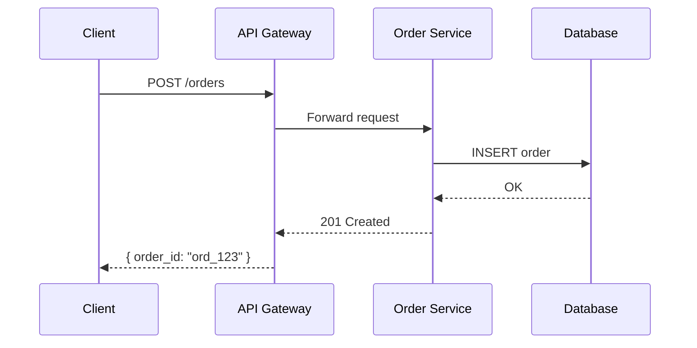

# Documentation Skill — Project & Code Documentation Writer

## Overview

This skill produces clear, accurate, and actionable documentation for software projects. Good documentation answers the reader's next question before they ask it. Whether it's a README for an open-source library, API reference docs, or an internal user guide, the goal is always the same: help the reader understand and use the thing without needing to talk to you.

## When to Use This Skill

- User asks to write or update a README, CONTRIBUTING, or CHANGELOG file
- User needs API documentation (REST, GraphQL, SDK, CLI)
- User wants a user guide, getting-started guide, or tutorial
- User asks to document code (add docstrings, JSDoc, comments)
- User needs architecture decision records or design docs
- User says "document this code" or "write docs for this project"
- User mentions مستندات, مستندسازی, راهنما, or داکیومنت
- User wants to generate a documentation site (Docusaurus, MkDocs, VitePress)
- User needs troubleshooting guides, runbooks, or on-call docs
- User asks for data model documentation or data dictionaries
- User wants migration guides, deprecation notices, or breaking change docs
- User needs onboarding checklists or new-hire setup guides

## Documentation Workflow

### Step 1: Understand the Project

Before writing a single word, understand what you're documenting.

1. **Read the codebase** — Use Glob to find key files, then Read them. Look for:
   - Package.json, setup.py, Cargo.toml, go.mod (project metadata)
   - Existing README or docs (to improve, not start from scratch)
   - Entry points and main modules
   - Configuration files
2. **Identify the audience** — Ask or infer who will read this:
   - End users? Developers integrating a library? Internal teammates? New hires?
3. **Identify the doc type** — README ≠ API reference ≠ tutorial ≠ architecture doc. Each has different structure and tone.

### Step 2: Gather Information

1. **For README files**: Identify project purpose, installation steps, usage examples, configuration options, and contribution guidelines.
2. **For API docs**: Find route definitions, request/response schemas, authentication methods, and error codes. Read the actual handler code.
3. **For user guides**: Understand the user workflow. What tasks do they need to accomplish? What's the happy path vs. edge cases?
4. **For code docs (docstrings)**: Read the function signatures, understand parameters, return values, and side effects.

### Step 3: Write the Documentation

Follow the structure appropriate for the doc type:

#### README Structure
```
1. Project name + one-line description
2. Badges (build status, version, license)
3. Features / Highlights (bullet list)
4. Quick Start (minimal working example — < 10 lines)
5. Installation (prerequisites + commands)
6. Usage (progressive: basic → intermediate → advanced)
7. Configuration (table of options with defaults)
8. API Reference (link or summary)
9. Contributing (link to CONTRIBUTING.md)
10. License
```

#### API Documentation Structure
```
1. Base URL and authentication
2. Common headers and error format
3. Endpoints grouped by resource:
   - Method + URL
   - Description
   - Request parameters (path, query, body) with types
   - Response schema with example
   - Error codes specific to this endpoint
4. Rate limits and pagination
```

#### Code Docstrings
- Follow the language convention (JSDoc for JS, Google/NumPy style for Python, rustdoc for Rust)
- Document: purpose, parameters (with types), return value, exceptions/errors, examples
- Don't state the obvious — explain *why*, not *what*

### Step 4: Validate and Refine

1. **Accuracy check** — Do the code examples actually work? Do the installation commands match the project's build system?
2. **Completeness check** — Are all public APIs documented? Are all configuration options listed?
3. **Clarity check** — Can someone unfamiliar with the project follow along? Remove jargon or define it.
4. **Formatting** — Use consistent heading levels, code blocks with language tags, and proper markdown.

## Output Format Templates

### Template 1: Standard README
```markdown
# Project Name

> One-line description of what this project does and who it's for.

[](link) [](link) [](link)

## Features
- ✅ Feature one with brief description
- ✅ Feature two with brief description
- ✅ Feature three with brief description

## Quick Start

```bash
npm install project-name
```

```javascript
import { thing } from 'project-name';
const result = thing(input);
console.log(result);
```

## Installation

### Prerequisites
- Node.js >= 18
- PostgreSQL >= 14

### Steps
1. Clone the repository
2. Copy `.env.example` to `.env` and fill in values
3. Run `npm install && npm run build`
4. Run `npm start`

## Usage

### Basic
[Simplest possible usage]

### Advanced
[Complex usage with options]

## Configuration

| Option | Type | Default | Description |
|--------|------|---------|-------------|
| `option1` | `string` | `"default"` | What it does |
| `option2` | `number` | `42` | What it does |

## API Reference

See [API docs](./docs/api.md) for full reference.

## Contributing

See [CONTRIBUTING.md](./CONTRIBUTING.md).

## License

MIT
```

### Template 2: API Reference Page
```markdown
# API Reference — [Resource Name]

Base URL: `https://api.example.com/v1`
Auth: Bearer token in `Authorization` header

---

## List Resources

`GET /resources`

Returns a paginated list of resources.

### Query Parameters

| Param | Type | Required | Description |
|-------|------|----------|-------------|
| `page` | `integer` | No | Page number (default: 1) |
| `limit` | `integer` | No | Items per page (default: 20, max: 100) |
| `status` | `string` | No | Filter by status: `active`, `archived` |

### Response `200 OK`

```json
{
  "data": [{
    "id": "res_abc123",
    "name": "Example",
    "status": "active",
    "created_at": "2024-01-15T10:30:00Z"
  }],
  "pagination": {
    "page": 1,
    "limit": 20,
    "total": 42,
    "total_pages": 3
  }
}
```

### Errors

| Status | Code | Description |
|--------|------|-------------|
| 401 | `UNAUTHORIZED` | Missing or invalid token |
| 422 | `VALIDATION_ERROR` | Invalid query parameters |
```

### Template 3: Architecture Decision Record (ADR)
```markdown
# ADR-001: [Title]

## Status
Accepted

## Context
[What is the issue that we're seeing that is motivating this decision or change?]

## Decision
[What is the change that we're proposing and/or doing?]

## Consequences

### Positive
- [Benefit 1]
- [Benefit 2]

### Negative
- [Downside 1]
- [Downside 2]

### Risks
- [Risk and mitigation]
```

### Template 4: Troubleshooting / Runbook
```markdown
# Troubleshooting — [System/Feature]

## Common Issues

### Issue: [Symptom]

**Cause:** [Root cause explanation]

**Check:**
1. Run: `command to diagnose`
2. Look for: [what to look for in output]

**Fix:**
1. Step one
2. Step two

**Prevention:**
- [How to prevent this in the future]

---

## Diagnostic Commands

| Purpose | Command |
|---------|---------|
| Check service health | `curl -f http://localhost:8080/health` |
| View recent errors | `journalctl -u service --since "1 hour ago"` |
| Check connectivity | `nc -zv db-host 5432` |
```

## Advanced Techniques

### 1. Doc-as-Code Pipeline
Treat documentation like code: store in version control, lint with tools like `markdownlint` and `vale`, run CI checks, and deploy via the same pipeline. Use sidecar files (`.mdx` for Docusaurus, `.md` for MkDocs) and generate API reference from OpenAPI specs automatically.

```bash
# Example CI check for documentation
npm run docs:lint      # markdownlint + vale
npm run docs:build     # Build the doc site
npm run docs:test      # Verify all code examples compile/run
```

### 2. Generated API Docs from OpenAPI/Swagger
Instead of hand-writing API docs, maintain an OpenAPI spec and generate the reference pages. Use `redocly` or `spectacle` for beautiful static output.

```yaml
# openapi.yaml — single source of truth
openapi: 3.1.0
info:
  title: My API
  version: 1.0.0
paths:
  /users/{id}:
    get:
      summary: Get user by ID
      parameters:
        - name: id
          in: path
          required: true
          schema:
            type: string
      responses:
        '200':
          description: User object
          content:
            application/json:
              schema:
                $ref: '#/components/schemas/User'
```

### 3. Incremental Documentation Strategy
Don't try to document everything at once. Prioritize: (1) README and getting started, (2) API reference, (3) troubleshooting, (4) architecture docs, (5) internal runbooks. Track documentation debt in issues with `doc-debt` labels.

### 4. Diagram-as-Documentation
Use Mermaid, PlantUML, or ASCII diagrams in markdown to illustrate architecture, data flow, and state machines. A good diagram replaces paragraphs of text.



### 5. Versioned Documentation
For libraries with multiple major versions, maintain versioned docs. Use Docusaurus versioning (`docusaurus docs:version 2.0`) or MkDocs `mike` plugin. Always link to the latest stable version and keep old versions accessible but clearly marked as archived.

### 6. Interactive Examples with CodeSandbox / StackBlitz
For UI libraries or CLIs, embed live runnable examples. Link to a CodeSandbox template that loads the latest version from npm.

### 7. Documentation Testing
Automatically verify that code examples in docs actually compile and run. Use `doctest` (Python), `skuba` (TypeScript), or custom scripts that extract code blocks and execute them in CI.

```bash
# Extract and test all JS code blocks from markdown
npx extract-markdown-code --language js --output /tmp/doc-tests/
node /tmp/doc-tests/*.js
```

## Common Patterns

### Pattern 1: Monorepo Package READMEs
In a monorepo (Turborepo, Nx, Lerna), each package needs its own README. Generate a template that links to the root README, lists dependencies on sibling packages, and shows package-specific usage.

```markdown
# @myorg/auth

> Authentication utilities for the MyOrg platform.

**Part of** [`@myorg/monorepo`](../../README.md)

## Installation

```bash
npm install @myorg/auth
```

## Usage

```typescript
import { createSession } from '@myorg/auth';
const session = await createSession({ userId: 'u_123' });
```

## Related Packages
- [`@myorg/api-client`](../api-client/README.md) — Uses sessions for API calls
- [`@myorg/middleware`](../middleware/README.md) — Session validation middleware
```

### Pattern 2: SDK Client Documentation
For SDK libraries, document every public method with typed parameters, return values, and at least one example. Group by resource.

```markdown
## Users

### `client.users.list(params?)`

List all users in the organization.

**Parameters:**

| Param | Type | Description |
|-------|------|-------------|
| `params.limit` | `number` | Max users to return (default: 25) |
| `params.cursor` | `string` | Pagination cursor from previous response |
| `params.role` | `'admin' \| 'member'` | Filter by role |

**Returns:** `Promise<{ data: User[], next_cursor: string | null }>`

**Example:**

```typescript
const { data, next_cursor } = await client.users.list({ limit: 10 });
for (const user of data) {
  console.log(user.name, user.email);
}
```

**Throws:**
- `AuthenticationError` — If the client is not authenticated
- `RateLimitError` — If rate limit is exceeded (auto-retries up to 3 times)
```

### Pattern 3: Internal Onboarding Guide
For new team members joining an internal project, create a comprehensive onboarding doc.

```markdown
# Onboarding — Team/Project Name

## Day 1: Environment Setup
1. [ ] Request access to [systems]
2. [ ] Clone repo: `git clone git@github.com:org/repo.git`
3. [ ] Install dependencies: `make setup`
4. [ ] Copy `.env.example` to `.env` — get values from [secrets manager]
5. [ ] Run database migrations: `make db-migrate`
6. [ ] Verify: `make test` passes

## Day 2: Architecture Walkthrough
- Read [Architecture ADR](./docs/adr/001-architecture.md)
- Key services: [list]
- Data flow: [diagram link]

## Key Contacts
- **Tech Lead:** @person — [slack handle]
- **On-call:** Rotate schedule in [pagerduty link]
- **Questions:** #team-[name] Slack channel
```

### Pattern 4: CLI Tool Documentation
For command-line tools, document every command, subcommand, and flag. Include output examples.

```markdown
# mytool

A fast code scaffolding tool.

## Installation

```bash
curl -fsSL https://mytool.dev/install.sh | sh
```

## Commands

### `mytool init [name]`

Initialize a new project.

```bash
$ mytool init my-app
✓ Created my-app/
✓ Created my-app/package.json
✓ Created my-app/tsconfig.json
✓ Created my-app/src/index.ts

Next: cd my-app && npm install
```

### `mytool generate <type> [name]`

| Flag | Description | Default |
|------|-------------|---------|
| `--path` | Output directory | `./src` |
| `--ts` | Generate TypeScript files | `true` |
| `--force` | Overwrite existing files | `false` |
```

### Pattern 5: Deprecation Notice Template
When removing or changing a feature, document it clearly for users.

```markdown
## ⚠️ Deprecation: `oldMethod()` (v2.x → v3.x)

**Removed in:** v3.0.0
**Replacement:** `newMethod()` with `options` parameter

### Why
[Explanation of why this change was necessary]

### Migration Guide

**Before (v2.x):**
```javascript
const result = client.oldMethod(query);
```

**After (v3.x):**
```javascript
const result = client.newMethod({ query, format: 'json' });
```

### Timeline
- v2.5.0 (YYYY-MM-DD): Deprecation warning added to `oldMethod()`
- v3.0.0 (YYYY-MM-DD): `oldMethod()` removed
```

## Edge Cases & Pitfalls

1. **Stale code examples** — Code examples drift from the actual API as the project evolves. Always verify examples against the current code before publishing.

2. **Documenting internal implementation details** — Documenting private functions, internal class hierarchies, or file-level organization locks you in. Users depend on it, and you can't refactor. Only document public APIs.

3. **README-first tunnel vision** — Not everything belongs in the README. If a doc is longer than 300 lines, split it into separate files (INSTALL.md, CONTRIBUTING.md, etc.).

4. **Missing "why"** — Good docs explain not just *what* a function does but *why* it exists, *why* you'd choose it over alternatives, and *why* it works the way it does.

5. **Assuming context** — Don't assume the reader knows your project's jargon, abbreviations, or internal terminology. Define acronyms on first use.

6. **Undocumented error handling** — Always document what errors a function can throw, what HTTP status codes an endpoint returns, and what the user should do when things go wrong.

7. **Over-documenting trivial code** — If a function is named `getUsername()` and takes no parameters and returns a string, a one-line docstring is enough. Don't write a paragraph.

8. **Ignoring non-happy paths** — Most documentation shows the happy path. Users hit errors. Document common error scenarios, edge cases, and how to recover.

9. **No searchability consideration** — Write headings that users would naturally search for. "How to reset my password" beats "Credential Revocation Protocol."

10. **Copy-paste-friendly but broken** — Code examples that look complete but actually need additional context (env vars, imports, config) to run. Always include the full minimal setup.

11. **Version mismatch** — Documenting v3 features while linking to v2 examples. Always note the minimum version required and use version-specific navigation if you have versioned docs.

12. **Ignoring accessibility in doc sites** — Documentation sites should meet WCAG 2.1 AA. Use proper heading hierarchy, alt text for images, sufficient color contrast, and keyboard navigation.

13. **Writing docs in isolation** — Documentation should be reviewed by someone who didn't write the code (and ideally, someone who doesn't know the project well) to catch assumptions.

14. **Forgetting to document configuration** — Every config option, environment variable, and command-line flag should be documented with type, default value, and description.

## Integration with Other Skills

- **technical-writing** — Use when documentation needs to be written as a standalone article, blog post, or tutorial rather than project-adjacent docs.
- **changelog** — Use when generating release notes or changelogs as part of the release documentation process.
- **summarization** — Use when creating executive summaries of documentation, or when summarizing a codebase to produce overview documentation.
- **api-integration** — Use when documenting how to integrate with third-party APIs; combine with API reference documentation patterns.
- **browser-automation** — Use when creating E2E test documentation or documenting browser-based workflows.
- **charts** — Use when documentation needs architecture diagrams, data flow diagrams, or visual process maps.
- **pdf** — Use when documentation needs to be exported as a polished PDF for stakeholders or compliance.
- **docx** — Use when documentation needs to be delivered as a Word document for enterprise environments.

## Principles

- **Show, don't tell.** A working code example beats a paragraph of explanation.
- **Start with the simplest thing that works.** Progress to advanced usage gradually.
- **Keep it updatable.** Avoid documenting implementation details that change frequently.
- **Don't document what's obvious from the code.** Document intent, constraints, and gotchas.
- **Be honest about limitations.** If something doesn't work, say so explicitly.
- **Document for the confused reader.** The person reading your docs is stuck. Help them get un-stuck.
- **Maintain a single source of truth.** Don't duplicate information across multiple doc files — link instead.
- **Review docs like code.** Docs deserve PRs, reviews, and CI checks just like code.
