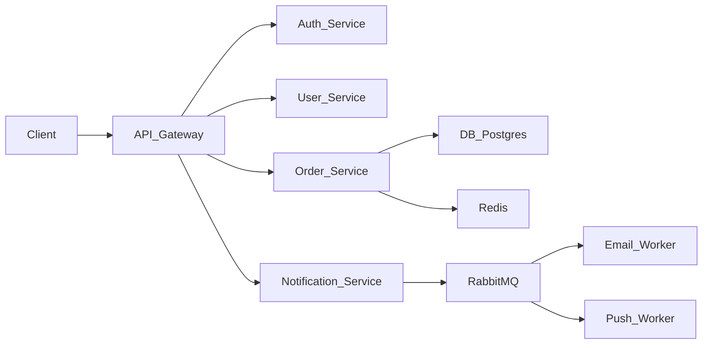

# System Design Skill — Scalable Architecture & Diagrams

## Overview

This skill produces concrete system designs: component breakdowns, data flows, technology choices, and scalability strategies. It focuses on making architecture decisions explicit, documenting trade-offs, and producing clear diagrams that a team can implement from.

## When to Use This Skill

- User asks to design a system, service, or platform from scratch
- User needs microservices decomposition or service boundaries
- User wants an architecture diagram or component diagram
- User asks how to scale, handle load, or improve availability
- User needs to choose between architectural patterns (monolith, microservices, event-driven, etc.)
- User wants a high-level design (HLD) or low-level design (LLD)
- User needs API gateway design or service mesh design
- User wants caching, load balancing, or messaging strategy
- User asks to design for high availability or disaster recovery
- User needs to review or improve an existing architecture

## Design Workflow

### Phase 1: Gather Requirements

1. **Functional requirements** — What must the system do? List the core features/operations.
2. **Non-functional requirements** — Estimate or ask about:
   - Expected scale (users, requests/sec, data volume)
   - Latency requirements (real-time? batch?)
   - Availability target (99.9%? 99.99%?)
   - Consistency requirements (strong? eventual?)
   - Security/compliance needs
3. **Existing constraints** — Current tech stack, team expertise, budget, timeline.
4. **Growth trajectory** — Is this for now, 6 months, or 3 years? Design for the target, not the current.

### Phase 2: High-Level Architecture

Define the major components and how they connect:

1. **Entry points** — API gateway, load balancer, CDN, web app
2. **Core services** — Identify service boundaries using domain-driven design principles (bounded contexts)
3. **Data stores** — Which data goes where (relational DB, document store, cache, search index, object storage)
4. **Integration layer** — Message queues, event bus, service-to-service communication (REST, gRPC, events)
5. **External dependencies** — Third-party APIs, payment providers, email services

### Phase 3: Deep-Dive Each Component

For each major component, specify:

- **Responsibility** — What does this component do? What does it NOT do?
- **Technology choice** — Specific tools/frameworks and why
- **API surface** — Key endpoints or interfaces
- **Data model** — What data does it own?
- **Scaling strategy** — Horizontal? Vertical? Sharding?

### Phase 4: Address Cross-Cutting Concerns

Cover these non-negotiables for any real system:

| Concern | Key Decisions |
|---------|---------------|
| **Authentication** | How do users identify? (JWT, sessions, OAuth) |
| **Authorization** | How are permissions enforced? (RBAC, ABAC, ACL) |
| **Observability** | Logging, metrics, tracing (ELK, Prometheus, Jaeger) |
| **Error handling** | Retry policies, circuit breakers, fallbacks |
| **Deployment** | Containerization, orchestration, CI/CD |
| **Caching** | What to cache, where, and invalidation strategy |
| **Security** | Input validation, rate limiting, encryption at rest/transit |
| **Configuration** | How are secrets and config managed? |

### Phase 5: Scalability & Reliability Analysis

1. **Bottleneck identification** — Where will the system break first under load?
2. **Scaling plan** — How does each component scale horizontally?
3. **Failure modes** — What happens when a component goes down? Plan for: single node failure, data center failure, cascading failures.
4. **Cost estimation** — Rough infrastructure cost at different scales.
5. **Capacity planning** — At what load does each component need to scale?

## Advanced Techniques

### 1. Back-of-Envelope Calculations

Start every system design with rough numbers to ground the architecture in reality:

```
Example: URL shortener at 100M daily shortens
- Writes: 100M/day = 1,157 QPS average, ~5,000 QPS peak
- Reads: 10x writes = 50,000 QPS peak
- Storage: 100M URLs × 500 bytes = 50 GB/year
- Cache: 80/20 rule → cache top 20M URLs = 10 GB
→ Need: 3-5 read replicas, write sharding at 1B URLs/day
```

### 2. Bounded Context Extraction

Use domain-driven design to find natural service boundaries:

```
E-Commerce Domain:
- Catalog Context → Product Service (product CRUD, categories, search)
- Ordering Context → Order Service (cart, checkout, order lifecycle)
- Identity Context → Auth Service (users, sessions, permissions)
- Payment Context → Payment Service (processing, refunds, ledger)
- Notification Context → Notification Service (email, push, SMS)
→ Each context owns its data. Cross-context communication via events.
```

### 3. Consistency Pattern Selection

Choose the right consistency model based on the use case:

| Pattern | Use When | Example |
|---------|----------|---------|
| **Strong (serializable)** | Financial transactions, inventory counts | Order payment processing |
| **Read-after-write** | User profile updates, content publishing | Update bio, see it immediately |
| **Eventual** | Social feeds, analytics, notifications | Like count, view count |
| **Causal** | Chat messages, collaborative editing | Message ordering |

### 4. Data Partitioning Strategies

Choose sharding strategy based on access patterns:

```
Range-based: Shard by user ID range (1-1M, 1M-2M, ...)
  → Simple, but hot spots if certain ranges are popular

Hash-based: Shard by hash(userId) % N
  → Even distribution, but resharding is hard

Directory-based: Lookup service maps key → shard
  → Flexible, but adds a dependency

Geographic: Shard by region (US-East, EU-West, ...)
  → Low latency per region, but cross-region queries are slow
```

### 5. Failure Mode Analysis (FMEA-lite)

For each critical component, analyze:
- **Failure mode**: What breaks?
- **Effect**: What happens to users?
- **Detection**: How do we know it broke?
- **Mitigation**: What do we do until it's fixed?

```
Component: Redis Cache
- Failure: Redis node crashes
- Effect: Cache miss storm → database overloaded
- Detection: Health check fails, latency spikes
- Mitigation: Circuit breaker opens, fallback to direct DB, auto-failover to replica
```

### 6. API Design Patterns for Inter-Service Communication

```
Synchronous (request-response):
  - REST/gRPC for commands ("create order")
  - Timeout: 3s for user-facing, 30s for internal

Asynchronous (fire-and-forget):
  - Message queue for events ("order.created")
  - At-least-once delivery with idempotent consumers

Backpressure:
  - Rate limiting at gateway
  - Queue-based buffering for burst traffic
  - Client-side throttling with exponential backoff
```

### 7. Multi-Region Architecture

For systems requiring global availability:

```
Pattern: Active-Active with conflict resolution

Region US-East          Region EU-West
┌──────────────┐      ┌──────────────┐
│  API Gateway  │◄────►│  API Gateway  │
│  App Servers  │      │  App Servers  │
│  DB Primary   │◄────►│  DB Primary   │
│  Cache        │      │  Cache        │
└──────────────┘      └──────────────┘
       │                      │
       └────── Global LB ─────┘

Conflict resolution: Last-write-wins with vector clocks
Data locality: Route EU users to EU region via GeoDNS
```

## Common Patterns

### Pattern 1: API Gateway + Microservices



**Use for:** Complex domains with multiple teams, independent scaling needs.

### Pattern 2: Event-Driven Architecture

```
Producer ──→ Message Broker ──→ Consumer A
                                Consumer B
                                Consumer C

Events:
  order.created → [PaymentService, InventoryService, NotificationService]
  payment.completed → [OrderService, NotificationService]
  inventory.low → [PurchasingService, NotificationService]

Tools: Kafka (high throughput), RabbitMQ (flexible routing), SQS (AWS native)
```

**Use for:** Loosely coupled services, audit trails, eventual consistency.

### Pattern 3: CQRS (Command Query Responsibility Segregation)

```
Write Path:                    Read Path:
Command → Service → Write DB   Query → Read DB → Response
                    ↓                         ↑
                   Event                      Sync/Async
                    ↓                         ↑
              Read Model Rebuilder ←──── Projection

Example: Product catalog
- Writes go to PostgreSQL (normalized, consistent)
- Events trigger Elasticsearch reindex (denormalized, searchable)
- Reads query Elasticsearch (fast, full-text search)
```

**Use for:** High read/write ratio, different data models for read vs. write.

### Pattern 4: Saga Pattern for Distributed Transactions

```
Create Order → Reserve Inventory → Process Payment → Ship
     │               │                  │             │
     ↓               ↓                  ↓             ↓
  [success]      [success]         [success]     [success]
     ↓               ↓                  ↓             ↓
  ──────────── ORDER COMPLETE ──────────────────────────

Compensation (if any step fails):
  Payment Failed → Cancel Payment (noop) → Release Inventory → Cancel Order

Orchestration: A Saga Orchestrator service coordinates the steps.
Choreography: Each service publishes events; others react. (simpler but harder to debug)
```

**Use for:** Multi-service transactions where 2PC is impractical.

### Pattern 5: Rate Limiting Architecture

```
Client Request
     │
     ▼
┌─────────────┐    ┌──────────────┐
│ API Gateway  │───►│ Rate Limiter │
└─────────────┘    └──────┬───────┘
                          │
                   ┌──────┴───────┐
                   │ Token Bucket  │  → 100 req/min per user
                   │   in Redis   │
                   └──────────────┘
                          │
               ┌──────────┴──────────┐
               │                     │
          [allowed]             [rejected]
               │                     │
               ▼                     ▼
          Service               429 Response
```

**Use for:** Public APIs, preventing abuse, fair resource allocation.

## Edge Cases & Pitfalls

1. **Over-engineering for current scale** — Designing a distributed system for 100 users. Start with a monolith and introduce complexity when needed.

2. **Ignoring the happy path performance** — Designing for failure but the happy path is slow. Optimize the common case first.

3. **Single point of failure in the gateway** — The API gateway itself can become an SPOF. Design it for HA from the start.

4. **Shared database anti-pattern** — Microservices sharing a single database creates tight coupling. Each service should own its data.

5. **Synchronous chains in microservices** — Service A calls B calls C calls D. Latency adds up and any failure cascades. Use async messaging for chains > 2.

6. **No circuit breakers** — When a downstream service is slow, the caller keeps waiting, exhausting its own threads. Circuit breakers fail fast.

7. **Ignoring data gravity** — Data tends to accumulate where it's written. Plan for where data lives and the cost of moving it.

8. **Forgetting about data deletion** — GDPR/right-to-delete is hard in event-sourced or denormalized systems. Plan for it.

9. **Message ordering assumptions** — Message queues don't guarantee global ordering. Use partition keys for ordering within a entity.

10. **No idempotency in consumers** — At-least-once delivery means duplicate messages. Every consumer must handle duplicates.

11. **Configuration sprawl** — Each service has its own config in different formats. Centralize configuration management.

12. **Monitoring blind spots** — Instrumenting services but not the infrastructure (Redis, DB, message queue). Monitor everything in the request path.

13. **Ignoring cold start times** — Serverless functions can have cold starts of 1-5 seconds. Don't use for latency-sensitive paths.

14. **No graceful degradation** — When a non-critical service fails, the whole system crashes. Design fallbacks (cached data, default values, feature flags).

15. **Database connection pool exhaustion** — Under load, too many open connections. Size pools correctly and use connection pooling (PgBouncer).

16. **Not planning for data migration** — Schema changes are hard in production. Use backward-compatible migrations and version your APIs.

## Integration with Other Skills

| Skill | When to Chain | How It Connects |
|-------|---------------|-----------------|
| **brainstorming** | Before system design | Evaluate architectural patterns before committing |
| **database-schema** | During component deep-dive | Design data models for each service's database |
| **task-planning** | After system design | Turn the architecture into an implementation plan |
| **fullstack-dev** | After planning | Implement the designed architecture |
| **charts** | For diagrams | Create component, sequence, and deployment diagrams |
| **web-search** | For technology evaluation | Research latest best practices and benchmarks |

## Output Format Templates

### Template 1: Full System Design Document

```markdown
## System Design: [System Name]

### Requirements
- **Functional:** [list]
- **Scale:** [RPS, users, data volume]
- **NFRs:** [latency p99, availability %, consistency model]

### Architecture Overview
[Mermaid diagram showing all components and connections]

### Component Details

#### [Component Name]
- **Role:** [what it does]
- **Tech:** [specific technology + version]
- **APIs:** [key endpoints]
- **Data:** [what it stores and where]
- **Scaling:** [horizontal/vertical, sharding strategy]

### Data Flow: [Primary Operation]
[Step-by-step walkthrough of a request through the system]

### Cross-Cutting Concerns
| Concern | Decision | Rationale |
|---------|----------|----------|

### Scalability Analysis
- **Bottlenecks:** [identified weak points]
- **Scaling path:** [how to grow each component]
- **Failure modes:** [what can break and how to handle it]

### Back-of-Envelope
[Key calculations: QPS, storage, bandwidth, cache size]

### Cost Estimate
| Component | At 1x Scale | At 10x Scale |
|-----------|-------------|---------------|
```

### Template 2: Architecture Comparison

```markdown
## Architecture Options: [System Name]

### Option A: [Name]
[Diagram + description]
| Aspect | Detail |
|--------|--------|
| Complexity | [Low/Med/High] |
| Scalability | [limit] |
| Team fit | [assessment] |

### Option B: [Name]
...

### Comparison
| Criteria | Option A | Option B | Option C |
|----------|----------|----------|----------|

### Recommendation
**→ [Option X]** because [reason].
```

### Template 3: Component Deep-Dive

```markdown
## Component Design: [Component Name]

### Responsibility
[What it does, bounded context]

### API Surface
| Method | Path | Request | Response |
|--------|------|---------|----------|

### Data Model
[Key entities and their relationships]

### Dependencies
- **Upstream:** [who calls this component]
- **Downstream:** [what this component calls]
- **External:** [third-party services]

### Scaling Strategy
[Current: X instances, Scale trigger: Y, Max: Z]

### Failure Modes
| Failure | Impact | Mitigation |
|---------|--------|------------|
```

### Template 4: Quick Architecture Sketch

```markdown
## Architecture: [Name]

```
[ASCII or Mermaid diagram]
```

**Stack:** [tech choices]
**Key decisions:** [2-3 bullet points]
**Main trade-off:** [what was sacrificed]
```

## Diagrams

Use Mermaid syntax for diagrams when the output supports it. Otherwise use ASCII art. Key diagram types:

- **System context diagram** — Shows the system and its external actors
- **Component diagram** — Shows internal components and their connections
- **Sequence diagram** — Shows the flow of a specific operation through components
- **Deployment diagram** — Shows how components map to infrastructure
- **State diagram** — Shows state transitions for entities or workflows

## Rules

- **Be technology-specific** — "PostgreSQL with read replicas" not "a database"
- **Justify every choice** — Don't just list technologies; explain why they're chosen over alternatives
- **Design for the stated scale** — Don't over-engineer a side project with Kubernetes if SQLite would work
- **Show trade-offs explicitly** — Every architectural decision has a cost; state it
- **Make the diagram the centerpiece** — A good diagram communicates more than paragraphs of text
- **Consider the data model early** — Architecture without data is just boxes and arrows
- **Do back-of-envelope math** — Ground the design in numbers, not hand-waving
- **Address failure modes** — A design that only works when everything is healthy is not a real design
- **Version your APIs** — Plan for breaking changes from day one
- **Identify the critical path** — Which component's failure would take down the whole system?
